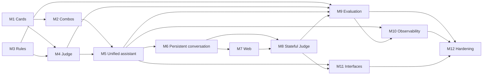

# Roadmap

## Purpose

This roadmap sets the milestone-level delivery sequence for Mana Leak. It orders the implementation of the settled design (`vision.md`, `architecture.md`, `data-model.md`, `contracts.md`) without redesigning it.

Each milestone is a PRD-sized delivery unit. PRDs add requirements and acceptance criteria; implementation plans add work packages and tasks. Neither belongs here.

```text
vision · architecture · data-model · contracts
        ↓
     ROADMAP
        ↓
       PRD
        ↓
implementation plan
        ↓
      tasks
```

## Delivery strategy

Mana Leak is delivered as capability increments, not architectural layers. Every milestone leaves the product demonstrably more capable than before:

```text
cards work
→ combos work
→ rules evidence works
→ evidence-grounded judging works
→ capabilities become one assistant
→ assistant becomes a persistent product
→ product reaches the browser
→ clarification workflow works
→ quality and safety become measurable
→ behaviour becomes observable
→ every interface reaches the same core
→ demo is hardened
```

Each milestone builds only the persistence, contracts, and interfaces its own capability needs. No milestone is pure foundation.

This is a solo 24-hour build. Milestones are sized so the core sequence fits that window with time left for integration and rehearsal in M12.

## Roadmap summary

| Milestone | Outcome | Depends on | Status |
|---|---|---|---|
| M1 — Card knowledge foundation | Deterministic search and inspection of current card data | Design docs, repository scaffold | Not Started |
| M2 — Known Commander combos | Discover and explain known combos from structured data | M1 | Not Started |
| M3 — Current rules knowledge | Retrieve cited current Comprehensive Rules evidence | Repository scaffold | Not Started |
| M4 — Evidence-grounded Rules Judge | Structured, cited rulings from card and rules evidence | M1, M3 (M2 for combo-related questions) | Not Started |
| M5 — Unified assistant orchestration | One natural-language entrypoint with routing and bounded tools | M2, M4 | Not Started |
| M6 — Persistent conversational application | Persisted, streamed conversations through the API | M5 | Not Started |
| M7 — Browser product experience | Core experience usable in the web UI | M6 | Not Started |
| M8 — Stateful Judge clarification | Multi-turn resolution of missing game state | M6, M7 | Not Started |
| M9 — Quality, evaluation, and safeguards | Measured, gated behaviour across all suites | M3, M4, M5, M8 | Not Started |
| M10 — Observability | End-to-end Langfuse traces, degrading safely | M5, M9 | Not Started |
| M11 — Shared-core interface completion | CLI and MCP parity over the same core | M5, M8 | Not Started |
| M12 — Demo hardening | Repeatable full demo from a clean local start | M9, M10, M11 | Not Started |

Status vocabulary: `Not Started`, `In Progress`, `Complete`, `Blocked`. The completed repository scaffold and design documents do not count toward M1.

## Milestone progression

| Milestone | Tangible increment |
|---|---|
| M1 | Find and inspect current cards |
| M2 | Discover known Commander combos |
| M3 | Retrieve current rules evidence |
| M4 | Produce cited rulings |
| M5 | Ask naturally through one assistant |
| M6 | Persist and stream conversations |
| M7 | Use Mana Leak in the browser |
| M8 | Resolve missing game state interactively |
| M9 | Measure correctness and safety |
| M10 | Inspect agent behaviour |
| M11 | Demonstrate CLI/MCP parity |
| M12 | Repeat the reliable full demo |

## Dependency view



M3 has no dependency on M1 or M2 and may run in parallel with them if useful. The execution order is still M1 → M12.

---

## M1 — Card knowledge foundation

### Outcome
Mana Leak can deterministically identify, search, and inspect current Magic card data from a local structured source.

### Why this milestone exists
Cards are the base evidence for every later capability: combos are made of cards, and rulings are about cards. It is also the cheapest way to establish the shared-core pattern, persistence, and provenance before any model is involved.

### Scope
- Ingestion of Scryfall-derived Oracle card data into local storage.
- The persistence foundation that card data needs.
- Structured card search over the defined filter set.
- Card lookup by name, face name, and identifier, with ambiguity reported explicitly rather than guessed.
- Card provenance and source-version awareness.
- A minimal command-line surface sufficient to demonstrate the capability through the shared core.

### Depends on
Repository scaffold and the design documents.

### Demonstrable increment
A developer can find and inspect real current cards, including multi-face cards, with no model involved.

### Success evidence
- Correct results for known cards by exact name, face name, and identifier.
- Ambiguous or misspelled names produce explicit candidates or a flagged fuzzy match.
- Structured filters (type, identity, legality, mana value, keyword, text) behave as defined.
- Every card carries provenance and a source version.
- Data persists across restarts.

### Out of scope
Combos, rules retrieval, model calls, judging, conversations, API, web UI.

---

## M2 — Known Commander combos

### Outcome
Mana Leak can identify and present known Commander Spellbook combos from structured combo data.

### Why this milestone exists
Combo discovery is the second step of the primary demo journey. It reuses card resolution from M1 and adds the only live external runtime dependency, so its fallback strategy must be proven early.

### Scope
- Commander Spellbook integration behind an adapter boundary.
- Combo search, combo lookup by identifier, and finding combos that include all supplied cards.
- Combo pieces, prerequisites, ordered steps, and results, with provenance.
- Local caching and an offline fixture fallback that uses the same domain contract.
- Command-line access through the shared core.

### Depends on
M1 (card name resolution).

### Demonstrable increment
```text
card
→ known combo
→ combo pieces, prerequisites, steps, results
```

The demo combo works even when Commander Spellbook is unreachable.

### Success evidence
- Known demo cards return their known combos with steps and results.
- Unresolvable or ambiguous card names fail explicitly instead of producing partial results.
- Fixture fallback serves the demo path with live access disabled, and results are marked as cached.
- No combo is ever produced by a model.

### Out of scope
Natural-language explanation by a model, rules legality, judging, EDHREC or popularity data.

---

## M3 — Current rules knowledge

### Outcome
Mana Leak can retrieve current Comprehensive Rules evidence relevant to a natural-language rules question, with stable citations.

### Why this milestone exists
The rules corpus is the highest-authority domain evidence and the only retrieval-augmented corpus. Retrieval quality limits judging quality, so it must be measurable before the judge is built on it.

### Scope
- Ingestion of the current Comprehensive Rules with version and provenance.
- Chunking that follows the rules' own hierarchy and preserves citation stability.
- Embedding and semantic retrieval.
- Keyword retrieval and direct rule-number lookup.
- A simple hybrid merge, with keyword-only fallback when embeddings are unavailable.
- Command-line access to rules search.
- The retrieval evaluation suite and the minimal harness needed to run it.

### Depends on
Repository scaffold. Independent of M1 and M2.

### Demonstrable increment
A developer asks a rules question or names a rule number and gets the relevant current rules sections with identifiable rule numbers and version.

### Success evidence
- Rule-number lookup returns the correct rule or subrule.
- Natural-language queries surface the expected rules in the retrieval suite at the agreed hit-rate target.
- Retrieval still returns results with embeddings disabled.
- Re-ingestion replaces the indexed version cleanly.

### Out of scope
Rulings, model reasoning over rules, reranking (unless the retrieval evaluation shows it is required).

---

## Checkpoint A — Evidence foundation

After M3, Mana Leak independently demonstrates:

```text
find a card
find a known combo
retrieve current rules
```

All three exist once in the shared core, carry provenance, and are ready to be composed.

---

## M4 — Evidence-grounded Rules Judge

### Outcome
Mana Leak turns current card and rules evidence into a structured, cited ruling, and refuses to rule when the evidence does not support one.

### Why this milestone exists
The judge is the product's core differentiator. It is built directly on the evidence layer, before routing or UI, so that citation integrity and abstention are proven in isolation.

### Scope
- The single model gateway, with configured models and bounded timeouts and retries.
- Per-turn evidence tracking, and citation validation against that evidence.
- Code-orchestrated evidence gathering (cards, rules, and known combos where relevant).
- The bounded sufficiency decision, with its local substitute.
- Structured ruling output covering all four ruling statuses.
- Safe failure on invalid output or unverifiable citations.
- Command-line access to the judge.

### Depends on
M1, M3; M2 for questions about known combos.

### Demonstrable increment
```text
card interaction
→ retrieve current cards
→ retrieve current rules
→ explain interaction
→ cited ruling
```

### Success evidence
- Demo interaction questions return validated rulings citing retrieved rules and cards.
- A ruling that cites unretrieved evidence is rejected and follows the documented retry and safe-failure path.
- Questions without supporting evidence return `insufficient_information` rather than an answer from model memory.
- Every ruling records model, prompt, rules, and card versions.

### Out of scope
Routing, the general tool loop, conversations, multi-turn clarification, web UI.

---

## M5 — Unified assistant orchestration

### Outcome
Cards, combos, and judging become one assistant behind a single natural-language entrypoint.

### Why this milestone exists
The vision requires one coherent assistant, not separate utilities. Routing, tool boundaries, limits, and screening must be in place before anything is exposed as a product.

### Scope
- Intent routing across `cards`, `combos`, `judge`, and `other`.
- The bounded tool loop for card and combo routes, with route-specific tool allowlists.
- Judge-route handoff to the code-orchestrated judge.
- Per-turn execution limits, result shaping, and structured tool failures.
- Input validation and safeguard screening, with code-owned consequences.
- Shared evidence handling across the turn.
- Audit events for routing, screening, tool, and limit outcomes.
- Deterministic routing and tool tests.

### Depends on
M2, M4.

### Demonstrable increment
A developer asks ordinary natural-language questions and Mana Leak selects the right capability:

```text
card
→ combo
→ "how does this work?"
→ "why is this legal?"
→ evidence
→ ruling
```

### Success evidence
- Routing and tool tests meet the agreed router-accuracy and tool-success targets.
- Tools outside a route's allowlist are never executed.
- Limits stop runaway turns with controlled outcomes.
- Obvious prompt-injection and secret-request inputs are refused.

### Out of scope
Persistence, streaming, HTTP API, web UI, clarification state.

---

## Checkpoint B — Intelligence foundation

After M5, all of these work through the shared core:

- card search and lookup;
- combo search and discovery;
- rules retrieval;
- the evidence-grounded judge with validated citations;
- routing with bounded, least-privilege tool use;
- screening and execution limits.

The application intelligence is complete. The product interface is not.

---

## M6 — Persistent conversational application

### Outcome
The assistant becomes a persistent, streaming conversational backend.

### Why this milestone exists
Persistence and streaming turn the intelligence into an application, and they are prerequisites for both the web UI and stateful clarification.

### Scope
- Conversations and messages persisted with stable identifiers.
- Bounded conversation context (recent turns plus summary).
- The shared turn orchestration entrypoint.
- Streamed turn events over the application API.
- The defined REST surface, health reporting, and consistent error mapping.
- Protection against concurrent turns in the same conversation.
- The API service running in the local Compose stack.

### Depends on
M5.

### Demonstrable increment
```text
start conversation
→ ask question
→ receive streamed answer
→ ask follow-up
→ reload
→ continue conversation
```

using a plain HTTP client.

### Success evidence
- Streamed event order matches the contract for each route.
- History, including structured results, survives reload and restart.
- Follow-ups use prior turns as context.
- Failures arrive as structured events or error responses, never as raw traces.

### Out of scope
Web UI, multi-turn Judge sessions, Langfuse.

---

## M7 — Browser product experience

### Outcome
The core Mana Leak experience is usable in the web interface.

### Why this milestone exists
The browser is the primary interface in the vision and the demo. It follows M6 so that it is a thin consumer of a proven backend.

### Scope
- Conversation creation, listing, and resuming.
- Chat history and input.
- Rendering of streamed responses.
- Display of card and combo results, rulings, and citations.
- Loading and error states.
- Consumption of the canonical stream contract, with translation in the web layer if a chat library is used.

### Depends on
M6.

### Demonstrable increment
The card → combo → explanation → ruling journey can be completed in a browser with no CLI or API interaction.

### Success evidence
- The primary journey up to the cited ruling works end to end in the browser.
- Reloading the page restores the conversation.
- Citations and rule references are visible alongside rulings.
- Errors and refusals are shown clearly.

### Out of scope
Visual polish, deck or visual analytics, voice. Clarification rendering beyond basic display waits for M8.

---

## M8 — Stateful Judge clarification

### Outcome
Mana Leak resolves rules questions that depend on missing game state across multiple conversational turns.

### Why this milestone exists
"Ask rather than guess" is a core product principle. It needs persistent conversations (M6) and a surface to show clarification (M7), so it comes after both.

### Scope
- Persistent Judge sessions tied to conversations.
- Known and missing game-state facts.
- Targeted clarification questions.
- Continuation on the next turn, and abandonment when the topic changes.
- Bounded clarification rounds with completion and exhaustion outcomes.
- Clarification display and answering in the web UI.
- The Judge-mode evaluation suite.

### Depends on
M6, M7.

### Demonstrable increment
```text
ambiguous rules question
→ identify missing information
→ ask targeted question
→ user answers
→ resume reasoning
→ cited ruling
```

and:

```text
insufficient after bounded clarification
→ insufficient_information
```

### Success evidence
- Judge-mode cases meet the agreed success target.
- Sessions survive reload and resume correctly.
- At most one session is active per conversation, and the round limit is never exceeded.
- No game-state fact is assumed silently when the case requires clarification.

### Out of scope
Full game-state modelling, rules simulation.

---

## Checkpoint C — Core product

After M8, the primary product journey works in the browser:

```text
search/identify card
→ discover known combo
→ understand combo
→ ask why it works
→ receive evidence-grounded ruling
→ ask ambiguous follow-up
→ clarification workflow
→ final ruling
```

Mana Leak should now feel like the intended product.

---

## M9 — Quality, evaluation, and safeguards

### Outcome
Mana Leak's important behaviours are measured and regression-gated rather than judged only by demos.

### Why this milestone exists
The full behaviour set only exists after M8. Earlier milestones add their own suites (retrieval, routing and tools, Judge mode). This milestone completes the rest and applies the project gates.

### Scope
- Deterministic selection and freezing of MTG-QA development and held-out sets.
- Current-rules gold cases.
- Completion of the retrieval, routing/tool, and Judge-mode suites.
- Adversarial and safeguard cases, including the critical hard-gate cases.
- The smoke suite.
- Deterministic and model-based grading, with versioned run records.
- The project's threshold and blocker gating.
- Handling of stale historical cases without changing expected answers.
- Safeguard fixes driven by adversarial results.

### Depends on
M3, M4, M5, M8.

### Demonstrable increment
The developer can show measured results for routing, tool use, retrieval, rules correctness, citations, Judge behaviour, and safeguards, and a passing smoke run.

### Success evidence
- The smoke suite passes its gates with zero unhandled exceptions.
- Development-set and gold-set results meet the agreed thresholds.
- Critical adversarial cases pass at 100%, and there are no fabricated citations.
- The held-out set is kept out of development runs and used only for final evaluation.

Historical evaluation data remains evaluation-only and never becomes runtime evidence.

### Out of scope
Running the full 145K corpus, chasing marginal historical-QA gains once gates pass.

---

## M10 — Observability

### Outcome
The full assistant workflow is inspectable through self-hosted Langfuse.

### Why this milestone exists
Tracing is required for the demo and makes M12 hardening faster. It comes after M9 so that evaluation runs are traced as well.

### Scope
- A self-hosted Langfuse stack in local Compose, following current official conventions, on its own database.
- Conversation-as-session correlation.
- Traces of screening, routing, tools, retrieval, model calls, Judge transitions, retries, and limits.
- Usage and cost metadata.
- Eval scores linked to traces.
- No-op degradation when Langfuse is unavailable.

### Depends on
M5, M9.

### Demonstrable increment
```text
user turn
→ screening
→ route
→ retrieval/tools
→ model
→ Judge state
→ final response
```

can be followed in one trace grouped by conversation.

### Success evidence
- A demo conversation appears as one Langfuse session with a complete trace per turn.
- Eval runs are visible with scores.
- Stopping Langfuse does not affect answers.

### Out of scope
A custom observability platform, alerting, dashboards beyond Langfuse defaults.

---

## M11 — Shared-core interface completion

### Outcome
The same Mana Leak capabilities are available consistently through the CLI and MCP, as well as the web.

### Why this milestone exists
The CLI grows from M1 onward. This milestone completes it and adds MCP, proving the shared-core invariant across all required interfaces.

### Scope
- A complete CLI surface, including chat, ingestion, evaluation, and structured JSON output.
- The MCP server exposing the defined domain tools and the judge.
- Consistent errors and exit behaviour across interfaces.
- Verification that no interface duplicates domain logic.

### Depends on
M5, M8.

### Demonstrable increment
The same card, combo, rules, and Judge capabilities, including a clarification round, demonstrated through web, CLI, and an MCP client.

### Success evidence
- Equivalent inputs give equivalent results across interfaces.
- MCP clients can find combos and obtain cited rulings.
- Administrative operations are not exposed over MCP.

### Out of scope
New capabilities, remote MCP transport, authentication.

---

## Checkpoint D — Feature-complete candidate

After M11, every required capability exists. No new required capability is introduced after this point. Remaining work is integration, reliability, and presentation.

---

## M12 — Demo hardening

### Outcome
Mana Leak is a repeatable, reliable buildathon demonstration.

### Why this milestone exists
Integration defects surface last. A protected block of time at the end is needed to make the complete demo dependable from a clean start.

### Scope
- Clean local startup of the full Compose stack from a fresh checkout with a populated environment file.
- A reliable data bootstrap path that does not depend on downloads at startup.
- Verification of fallback paths (combos offline, keyword-only retrieval, Langfuse down).
- Final smoke and held-out evaluation.
- Rehearsal of the primary demo.
- Langfuse, web, CLI, and MCP verification.
- Secret and configuration review.
- Removal of demo-breaking defects.
- README quick-start completion.

### Depends on
M9, M10, M11.

### Demonstrable increment
The complete agreed demo runs from beginning to end without manual repair.

### Success evidence
- Two consecutive clean-start demo rehearsals succeed.
- Final gates pass, and the held-out result is within the agreed margin of the development result.
- No secrets appear in the repository, traces, logs, or errors.

### Out of scope
New product features.

---

## Roadmap and PRDs

Each milestone becomes one PRD, unless a milestone is clearly too large for one reviewable unit. In that case it may be split into a small number of tightly related PRDs that together deliver the milestone's increment.

A PRD expands the milestone's Outcome, Scope, Depends on, Demonstrable increment, Success evidence, and Out of scope into:

```text
problem/context
requirements (functional and non-functional)
acceptance criteria
interfaces affected
test/evaluation requirements
constraints
risks/fallbacks
```

A PRD must stay within its milestone's scope and the settled design documents. If it finds a design gap, the gap is reported and the relevant design document is updated deliberately, not redesigned inside the PRD.

After a PRD is reviewed and approved, an implementation plan derives work packages, components, technical sequence, tests, and tasks. Coding does not start directly from a roadmap milestone.

## Execution model

```text
select next roadmap milestone
→ derive PRD
→ review PRD
→ derive implementation plan
→ execute implementation plan
→ validate milestone against its success evidence
→ update roadmap status
→ select next milestone
```

A milestone is `Complete` only when its demonstrable increment works and its success evidence holds. Unresolved demo-threatening blockers in the current milestone take priority over starting the next one.

## Cut strategy

If time runs short, cut in this order:

1. voice;
2. richer card-search functionality;
3. UI polish;
4. optional visual or deck analytics;
5. retrieval or reranking sophistication beyond required quality;
6. automated source-refresh convenience;
7. evaluation volume beyond the minimum useful gates.

These outcomes are not optional: card capability, Commander Spellbook combos, current rules retrieval, the structured evidence-grounded judge, citations, `insufficient_information` behaviour, stateful clarification, unified routing and tool boundaries, persistent streamed conversation, the browser experience, core evaluations and safeguards, Langfuse, CLI, and MCP.

When a required capability threatens the schedule, simplify its implementation rather than removing it.

## Optional stretch roadmap

Stretch work starts only after M12's demo is reliable, and in this order:

1. speech-to-text (preferred first stretch goal);
2. browser microphone input;
3. text-to-speech;
4. richer realtime voice interaction;
5. richer card-search and UI improvements.

## Roadmap completion

The roadmap is complete when Mana Leak demonstrates the product vision end to end:

```text
card
→ combo
→ explanation
→ rules question
→ current evidence
→ cited ruling
→ ambiguous state
→ clarification
→ final ruling
```

and also has persistent streamed web conversation, bounded routing and tool use, evaluation and safeguard evidence, Langfuse observability, CLI access, MCP access, and reliable local execution.
