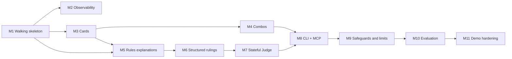

# Roadmap

## Purpose

This roadmap sets the milestone-level delivery sequence for Mana Leak. It orders the implementation of the settled design (`vision.md`, `architecture.md`, `data-model.md`, `contracts.md`) without redesigning it.

This roadmap is the overall implementation plan for Mana Leak. Each milestone is a PRD-sized delivery unit. PRDs define what is built (requirements and acceptance criteria); PRD plans define how (work packages, sequence, tests, tasks). Neither belongs here.

```text
vision · architecture · data-model · contracts
        ↓
     ROADMAP
        ↓
       PRD
        ↓
    PRD plan
```

## Delivery strategy

Mana Leak is delivered as a walking skeleton that grows one capability at a time, not as architectural layers. The full product — persisted, streamed, browser-based chat — exists from the first milestone; every later milestone ships a complete capability through that same browser chat and leaves the product demonstrably more capable than before:

```text
a working chat product exists
→ every turn is observable
→ cards work
→ combos work
→ rules are explained with citations
→ rulings are judged with citations
→ ambiguity resolves through clarification
→ every interface reaches the same core
→ the system resists adversarial and runaway input
→ quality and safety become measurable
→ the demo is hardened
```

Each milestone builds only the persistence, contracts, and interfaces its own capability needs beyond what already exists.

This is a solo build with no fixed per-milestone time budget. The checkpoint rules below — triggered by scope, not hours — are the schedule safety net.

## Roadmap summary

| Milestone | Outcome | Depends on | Status |
|---|---|---|---|
| M1 — Walking skeleton | A persisted, resumable, streamed chat product in the browser, with a plain model answer | Design docs, repository scaffold | Not Started |
| M2 — Observability | Every chat turn traced in self-hosted Langfuse, degrading safely when it is down | M1 | Not Started |
| M3 — Cards | Deterministic search and inspection of current card data, reachable in chat | M1 | Not Started |
| M4 — Combos | Discover and explain known Commander Spellbook combos in chat | M3 | Not Started |
| M5 — Rules explanations | Cited natural-language rules explanations and exact rule text, in chat | M1, M3 | Not Started |
| M6 — Structured rulings | Structured, cited legality rulings, with force-ask on unstated assumptions | M5; M4 for combos | Not Started |
| M7 — Stateful Judge | Multi-turn clarification resolves missing game state | M6 | Not Started |
| M8 — CLI + MCP | CLI and MCP reach parity with the web chat | M4, M7 | Not Started |
| M9 — Safeguards & limits | Screening and execution limits hardened against adversarial input | M8 | Not Started |
| M10 — Evaluation | Measured, gated behaviour across all suites | M9 | Not Started |
| M11 — Demo hardening | Repeatable full demo from a clean local start | M10 | Not Started |

Status vocabulary: `Not Started`, `In Progress`, `Complete`, `Blocked`. The completed repository scaffold and design documents do not count toward M1.

## Milestone progression

| Milestone | Tangible increment |
|---|---|
| M1 | Chat with an AI in the browser, reload, continue |
| M2 | Inspect every chat turn in Langfuse |
| M3 | Ask about cards in chat |
| M4 | Find and explain known combos in chat |
| M5 | Get cited rules explanations and exact rule text in chat |
| M6 | Get structured, cited legality rulings in chat |
| M7 | Resolve missing game state through clarification in chat |
| M8 | Use the same capabilities via CLI and MCP |
| M9 | Adversarial and runaway input are safely handled |
| M10 | Measure correctness and safety across all suites |
| M11 | Repeat the reliable full demo |

## Dependency view



M2 depends only on M1 and may be built in parallel with M3 onward; the execution order below is still M1 → M11.

---

## M1 — Walking skeleton

### Outcome
A persisted, resumable, streamed chat conversation works end to end in the browser, with a plain model answer and no domain capability yet.

### Why this milestone exists
This proves the full vertical slice — database, API, streaming, model gateway, and web UI — before any domain capability is added, so every later milestone adds a capability to an already-working product instead of integrating one for the first time at the end.

### Scope
- Docker Compose stack: Postgres with Alembic migrations for `conversation` and `message`.
- The FastAPI SSE endpoint and the `process_turn` turn-orchestration skeleton.
- The model gateway (LiteLLM/OpenRouter) with configuration.
- The Next.js chat UI behind a `/api/*` route-handler proxy to `API_BASE_URL`, with SSE streaming passthrough; the browser never calls the API directly.
- Persisted, resumable conversations.
- Every message resolves to the `other` route with a plain streamed model answer; no routing logic and no tools yet.
- A `/health` endpoint, so Compose health checks never block on a route that doesn't exist.

### Depends on
Repository scaffold and the design documents.

### Demonstrable increment
Chat with an AI in the browser, reload the page, and continue the conversation.

### Success evidence
- SSE events stream a plain assistant answer to the browser in the documented order.
- Conversation and message history persist across reload and container restart.
- `/health` reports accurately, and Compose brings up postgres, api, and web cleanly from a fresh checkout.
- Every message gets a plain model response; no domain routing exists yet.

### Out of scope
Cards, combos, rules, judging, routing beyond `other`, tool use, observability, CLI, MCP.

---

## M2 — Observability

### Outcome
Every chat turn is traced end to end in self-hosted Langfuse, correlated by conversation, degrading safely when Langfuse is unavailable.

### Why this milestone exists
Tracing needs to be live before any domain capability is added, so everything from M3 onward is debuggable from the moment it ships instead of retrofitted after the whole system is built. Proving the stack and its no-op degrade on the simplest possible turn removes that risk before tool calls, retrieval, and judging raise the stakes.

### Scope
- A self-hosted Langfuse stack in local Compose, following the official stack, on its own database.
- Conversation-as-session correlation, with a trace for every turn.
- No-op degradation when Langfuse is unavailable; chat answers are unaffected.

### Depends on
M1.

### Demonstrable increment
Have a conversation in the browser chat, then inspect every turn of it in Langfuse as one session.

### Success evidence
- A demo conversation appears as one Langfuse session with a complete trace per turn.
- Stopping Langfuse does not affect chat answers.

### Out of scope
Domain capabilities (cards, combos, rules, judging — not shipped yet); tool-, retrieval-, and Judge-specific trace detail, added as each capability ships; CLI, MCP; custom dashboards or alerting.

---

## Checkpoint A — Product skeleton

After M2, Mana Leak is a real product with no domain capability yet: conversations persist and stream through the browser chat, every turn gets a plain model answer, and every turn is traceable in Langfuse.

---

## M3 — Cards

### Outcome
Mana Leak can deterministically search, look up, and inspect current Magic card data, and answer card questions through the router in the browser chat.

### Why this milestone exists
Cards are the base evidence for every later capability — combos are made of cards, and rulings are about cards — and the first real domain route proves the router and bounded tool-loop pattern every later route reuses.

### Scope
- Ingestion of Scryfall-derived Oracle card data into local storage, and the persistence it needs.
- Structured card search over the defined filter set; lookup by name, face name, and identifier, with ambiguity reported explicitly rather than guessed.
- Card provenance and source-version awareness.
- Intent routing (`cards`|`other`), with the bounded tool loop and a `cards`-route tool allowlist.
- CLI access to card search and lookup.

### Depends on
M1.

### Demonstrable increment
Ask about cards in the browser chat — find and inspect real current cards, including multi-face cards.

### Success evidence
- Correct results for known cards by exact name, face name, and identifier.
- Ambiguous or misspelled names produce explicit candidates or a flagged fuzzy match.
- Structured filters (type, identity, legality, mana value, keyword, text) behave as defined.
- Every card carries provenance and a source version.
- The router selects `cards` for card questions and `other` otherwise; tools outside the allowlist never execute.

### Out of scope
Combos, rules retrieval, judging, multi-route reasoning beyond `cards`/`other`.

---

## M4 — Combos

### Outcome
Mana Leak can find and present known Commander Spellbook combos from structured combo data, through the router in the browser chat.

### Why this milestone exists
Combo discovery is the second step of the primary demo journey. It reuses card resolution from M3 and adds the only live external runtime dependency, so its fallback strategy is proven early.

### Scope
- Commander Spellbook integration behind an adapter boundary.
- Combo search, lookup by identifier, and finding combos that include all supplied cards; pieces, prerequisites, ordered steps, and results, with provenance.
- Local caching and an offline fixture fallback using the same domain contract; `source: live|cache|fixture` on every result.
- The router gains `combos`; the tool-loop allowlist extends to it.
- CLI access to combo search and find.

### Depends on
M3.

### Demonstrable increment
Find and explain a known combo in the browser chat — card → known combo → pieces, prerequisites, steps, results. The demo combo works even when Commander Spellbook is unreachable.

### Success evidence
- Known demo cards return their known combos with steps and results.
- Unresolvable or ambiguous card names fail explicitly instead of producing partial results.
- Fixture fallback serves the demo path with live access disabled, and results are marked by `source`.
- A live miss with no cache or fixture coverage returns `dependency_unavailable`, never an empty list.
- No combo is ever produced by a model.

### Out of scope
Natural-language explanation of why a combo works (M5/M6), rules legality, judging, EDHREC or popularity data.

---

## M5 — Rules explanations

### Outcome
Mana Leak retrieves current Comprehensive Rules evidence and answers rules questions with a cited, natural-language explanation — or deterministic exact rule text — through a new `judge` route, refusing to answer when evidence or game state is insufficient.

### Why this milestone exists
The rules corpus is the highest-authority domain evidence. Shipping the first judge output around explanations, which need simpler semantics than a legality verdict, proves retrieval quality, citation presence, and the insufficient-evidence refusal before M6 hardens citation validation and adds legality rulings, and before M7 adds sessions.

### Scope
- Ingestion of the current Comprehensive Rules with version and provenance; chunking that follows the rules' own hierarchy.
- Embedding and semantic retrieval, keyword retrieval, and direct rule-number lookup; a hybrid merge with keyword-only fallback.
- The judge's internal rules query composes the question with identified card names and short Oracle excerpts; the public `RuleSearchRequest.query` stays length-bounded for other callers.
- The router gains `judge` alongside `cards`/`combos`/`other`; code-orchestrated evidence gathering (cards from M3, rules from this milestone) feeds the judge — no tools are exposed to the model.
- A bounded sufficiency decision: enough evidence and state to answer, or not.
- Judge output kinds: `RulesExplanation` (cited natural-language explanation, able to walk through multi-step board states, the default for rules/interaction questions) and `RuleText` (deterministic, verbatim rule lookup, no model paraphrase, for rule-number requests). `RulesExplanation` persists in the `ruling` table with a new `kind` column (`ruling`|`explanation`); `RuleText` is message-payload only.
- Pre-M7 rule: insufficient evidence or state returns `insufficient_information` listing the missing facts, with no session row (M7 replaces this with real clarification).
- Sources are the Comprehensive Rules only; a question that genuinely depends on tournament policy (MTR/IPG) is flagged as such, not ruled on.
- CLI access to rules search and to the judge route.
- The retrieval evaluation suite and the harness to run it.

### Depends on
M1, M3.

### Demonstrable increment
Ask a rules question — including a multi-step interaction — in the browser chat and get a cited explanation; ask for a rule's exact text and get it verbatim; ask something the current rules don't settle and get `insufficient_information` listing what's missing.

### Success evidence
- Rule-number lookup returns the correct rule or subrule, verbatim, with no model paraphrase.
- Natural-language queries surface the expected rules in the retrieval suite at the agreed hit-rate target.
- A demo multi-step interaction (for example, casting Panglacial Wurm mid-search while paying with Selvala, Explorer Returned) gets a correctly cited, step-by-step explanation.
- Questions without supporting evidence return `insufficient_information` rather than a guess from model memory.
- Every explanation or rule-text result records model, prompt, and rules version.
- Retrieval still returns results with embeddings disabled.

### Out of scope
Legality rulings (`Ruling`), citation validation against an evidence ledger, the second evidence pass, and force-ask (all M6); stateful clarification and sessions (M7).

---

## M6 — Structured rulings

### Outcome
Mana Leak adds structured, cited legality rulings alongside M5's rules explanations, and hardens both with real citation validation, a second evidence pass, and force-ask, so neither output kind can carry an unstated assumption past the user.

### Why this milestone exists
Legality tolerates less ambiguity than an explanation — a wrong `legal`/`illegal` is a worse failure than an imprecise explanation. Building the validation machinery here, and applying it back to M5's explanations, means both judge outputs are trustworthy before M7 adds session state on top.

### Scope
- `Ruling{status: legal|illegal|conditional|insufficient_information}`, chosen by the judge's `answer_kind` field alongside `RulesExplanation`/`RuleText`.
- Citation validation against the turn's evidence ledger, applied to both `Ruling` and `RulesExplanation`; safe failure and a documented retry on invalid or unverifiable citations.
- A bounded second pass: rule numbers the draft cites but the ledger lacks are fetched by rule-number lookup, and the draft is redrafted once.
- Force-ask: any draft — any status, not only `conditional` — with non-empty `assumptions` while clarification rounds remain converts to the pre-M7 `insufficient_information` result, with the same bookkeeping as a plain insufficiency; `missing_information` stays empty on every other status.

### Depends on
M5; M4 for questions about known combos.

### Demonstrable increment
Ask whether an interaction is legal in the browser chat and get a validated, cited ruling (`legal`, `illegal`, or `conditional`), or `insufficient_information` listing exactly what's missing — and M5's explanations now carry the same validation.

### Success evidence
- Demo legality questions return validated rulings citing retrieved rules and cards.
- A ruling or explanation that cites unretrieved evidence is rejected and follows the documented retry and safe-failure path.
- A draft with assumptions never reaches the user as a bare `legal`/`illegal`/`conditional` answer while rounds remain.
- Every ruling records model, prompt, rules, and card versions.

### Out of scope
Stateful sessions and multi-turn clarification (M7); CLI/MCP parity beyond what M5 already exposes (M8).

---

## Checkpoint B — Evidence and judging foundation

After M6, cards, combos, cited rules explanations, exact rule text, and structured legality rulings all work through the shared core in the browser chat. Only stateful clarification and the remaining interfaces and hardening are left.

**Checkpoint rule:** if full scope beyond this point is at risk, apply the minimum acceptable increment (below) starting with M7.

---

## M7 — Stateful Judge

### Outcome
Mana Leak resolves rules questions that depend on missing game state across multiple conversational turns, replacing the pre-M7 `insufficient_information` shortcut with real clarification.

### Why this milestone exists
"Ask rather than guess" needs persistent conversations, already in place since M1, and a judge whose output is already trustworthy (M5, M6). This milestone closes the loop the pre-M7 rule left open.

### Scope
- Persistent Judge sessions tied to conversations; at most one active session per conversation; known and missing game-state facts; targeted clarification questions.
- Bounded clarification rounds (`JUDGE_MAX_CLARIFICATIONS`, default 3) with completion and exhaustion outcomes. Force-ask conversions (M6) now perform full session bookkeeping instead of the pre-M7 shortcut.
- Continuation: `ContinuationDecision{kind: answer|new_question|leave_session}`. A closed list of deterministic cancel phrases, matched against the whole message, ends the session without a continuation call. `new_question` is a new rules or legality question: the old session is set to `abandoned` and a new judge flow starts. `leave_session` is anything else, including card, combo, or general requests: the session is set to `abandoned` and the message routes normally.
- Session controls: a web "Judge session" indicator with "End session" and "New chat", plus a stop-generation control while streaming; CLI slash commands `/cancel`, `/new <question>`, `/help` (a leading `/` is never read as a card name). Controls send explicit actions, not text; plain text is never matched as a cancel phrase.
- Clarification display and answering in the web UI.
- The Judge-mode evaluation suite.

### Depends on
M6.

### Demonstrable increment
In the browser chat: an ambiguous rules question → identify missing information → ask a targeted question → the user answers → resume reasoning → cited ruling. Insufficient after bounded rounds → `insufficient_information`. A mid-session card lookup is answered normally without derailing the judge session.

### Success evidence
- Judge-mode cases meet the agreed success target.
- Sessions survive reload and resume correctly.
- At most one session is active per conversation, and `JUDGE_MAX_CLARIFICATIONS` is never exceeded.
- A deterministic cancel control ends the session with no continuation call.
- A mid-session topic change is classified `new_question` or `leave_session` correctly, never silently folded into the wrong flow.

### Out of scope
Full game-state modelling, rules simulation; CLI/MCP session-control parity (M8).

---

## Checkpoint C — Core product

After M7, the complete primary journey works end to end in the browser:

```text
search/identify card
→ discover known combo
→ ask why it works
→ receive a cited rules explanation
→ ask whether it's legal
→ receive a cited ruling
→ ask an ambiguous follow-up
→ clarification workflow
→ final ruling
```

Mana Leak should now feel like the intended product.

**Checkpoint rule:** if full scope beyond this point is at risk, apply the minimum acceptable increment to M8–M10.

---

## M8 — CLI + MCP

### Outcome
The CLI and MCP server reach parity with the web chat: thin adapters over `process_turn` and the domain services, with no duplicated domain logic.

### Why this milestone exists
The CLI already grows incrementally from M3 onward, gaining commands as each capability ships. This milestone completes the CLI surface and adds MCP, proving the shared-core invariant — including judge continuation semantics — across every required interface.

### Scope
- A complete CLI surface: chat, ingestion, evaluation commands, structured JSON output, and the `/cancel`, `/new <question>`, `/help` session controls.
- The MCP server exposing six read tools (`search_cards`, `get_card`, `search_combos`, `find_combos`, `get_combo`, `search_rules`) plus `judge`, with an optional `action: "answer" | "new_question" | "end_session"` argument.
- CLI `judge` and MCP `judge` both call the shared turn path (`process_turn`, route forced to `judge`). An active session's continuation decision is checked first, before any forced route, so a clarification answer is never misread as a new question.
- Consistent errors and exit behaviour across interfaces; verification that no interface duplicates domain logic.

### Depends on
M4, M7.

### Demonstrable increment
The same card, combo, rules-explanation, rule-text, and ruling capabilities — including a full clarification round — demonstrated through the CLI and an MCP client, matching what already works in the browser chat.

### Success evidence
- Equivalent inputs give equivalent results across web, CLI, and MCP.
- MCP clients can find combos and obtain cited rulings and explanations.
- A CLI clarification answer continues the same session rather than opening a new one.
- Administrative operations are not exposed over MCP.

### Out of scope
New capabilities, remote MCP transport, authentication.

---

## Checkpoint D — Feature-complete candidate

After M8, every required capability and every required interface (web, CLI, MCP) exists. No new required capability is introduced after this point; remaining work is safeguard hardening, measurement, and demo polish.

**Checkpoint rule:** if M9 or M10's full scope threatens M11's rehearsal time, apply their minimum acceptable increment first — M11 is never skipped.

---

## M9 — Safeguards & limits

### Outcome
Mana Leak's execution is hardened against adversarial and runaway input, consistently across every route and interface.

### Why this milestone exists
Safeguards matter most once every route and interface exists (M8) and can be driven adversarially from any of them; hardening them now means the gates in M10 measure an already-hardened system.

### Scope
- Input validation and safeguard screening, with code-owned consequences rather than model-decided refusals.
- Per-turn execution limits (model-call cap, tool-call cap, turn timeout) enforced consistently across every route, with structured failures instead of raw errors.
- Audit events for routing, screening, tool, and limit outcomes.
- Adversarial test cases, including the critical hard-gate cases.

### Depends on
M8.

### Demonstrable increment
An adversarial input (prompt injection, a secret request) is refused with a clear, structured response in the browser chat, and consistently across CLI and MCP; a runaway turn is stopped by its limit with a controlled outcome.

### Success evidence
- Obvious prompt-injection and secret-request inputs are refused on every route.
- Limits stop runaway turns with controlled outcomes.
- Critical adversarial cases pass.
- Audit events are recorded for every screening, limit, and tool outcome.

### Out of scope
Evaluation reporting and gates (M10), new capabilities.

---

## M10 — Evaluation

### Outcome
Mana Leak's important behaviours are measured and regression-gated across all suites, rather than judged only by demos.

### Why this milestone exists
The full behaviour set only exists once every capability (M3–M7), interface (M8), and safeguard (M9) ships. This milestone completes the remaining suites and applies the project's gates.

### Scope
- Deterministic selection and freezing of MTG-QA development and held-out sets, and current-rules gold cases.
- Completion of the retrieval, routing/tool, and Judge-mode suites.
- The smoke suite (28 cases: 10 mtg_qa, 5 current_rules, 5 routing_tool, 5 adversarial, 3 judge_mode).
- Deterministic and model-based grading, with versioned run records.
- The project's threshold and blocker gating (`contracts.md` → Evaluation contracts → Gates).
- Handling of stale historical cases without changing expected answers.

### Depends on
M9.

### Demonstrable increment
A passing smoke run and measured results for routing, retrieval, rules correctness, citations, Judge behaviour, and safeguards — every case exercises a capability already reachable through the browser chat.

### Success evidence
- The smoke suite passes its gates with zero unhandled exceptions.
- Development-set and gold-set results meet the agreed thresholds.
- Critical adversarial cases pass at 100%; `citation_valid` is 100%; `citation_relevant` meets its gate on current_rules/judge_mode cases.
- The held-out set is kept out of development runs and used only for final evaluation.

### Out of scope
Running the full historical corpus, chasing marginal historical-QA gains once gates pass.

---

## M11 — Demo hardening

### Outcome
Mana Leak is a repeatable, reliable buildathon demonstration.

### Why this milestone exists
Integration defects surface last. A protected final pass makes the complete demo dependable from a clean start, regardless of how the earlier milestones went.

### Scope
- Clean local startup of the full Compose stack from a fresh checkout with a populated environment file.
- A reliable data bootstrap path that does not depend on downloads at startup.
- Verification of fallback paths (combos offline, keyword-only retrieval, Langfuse down).
- Final smoke and held-out evaluation; rehearsal of the primary demo across web, CLI, and MCP.
- Secret and configuration review; removal of demo-breaking defects; README quick-start completion.

### Depends on
M10.

### Demonstrable increment
The complete agreed demo runs from beginning to end in the browser, without manual repair.

### Success evidence
- Two consecutive clean-start demo rehearsals succeed.
- Final gates pass, and the held-out result is within the agreed margin of the development result.
- No secrets appear in the repository, traces, logs, or errors.

### Out of scope
New product features.

---

## Roadmap and PRDs

Each milestone becomes one PRD, unless a milestone is clearly too large for one reviewable unit. In that case it may be split into a small number of tightly related PRDs that together deliver the milestone's increment.

A PRD expands the milestone's Outcome, Scope, Depends on, Demonstrable increment, Success evidence, and Out of scope into:

```text
problem/context
requirements (functional and non-functional)
acceptance criteria
interfaces affected
test/evaluation requirements
constraints
risks/fallbacks
```

A PRD must stay within its milestone's scope and the settled design documents. If it finds a design gap, the gap is reported and the relevant design document is updated deliberately, not redesigned inside the PRD.

After a PRD is reviewed and approved, a PRD plan derives work packages, components, technical sequence, tests, and tasks, and tracks their progress. Coding does not start directly from a roadmap milestone.

Location: `docs/prds/<milestone>-<slug>.md` for the PRD and `docs/prds/<milestone>-<slug>.plan.md` for its PRD plan (e.g. `docs/prds/M1-walking-skeleton.md`). A split milestone uses one pair per PRD (`M6a-…`, `M6b-…`).

## Execution model

```text
select next roadmap milestone
→ derive PRD
→ review PRD
→ derive PRD plan
→ execute PRD plan
→ validate milestone against its success evidence
→ update roadmap status
→ select next milestone
```

A milestone is `Complete` only when its demonstrable increment works and its success evidence holds. Unresolved demo-threatening blockers in the current milestone take priority over starting the next one.

## Minimum acceptable increment

If a checkpoint rule above is invoked, stop building the full version of the remaining milestones and build only the minimum acceptable increment below, in order, protecting M11.

- **M7** — One clarification round only (same session semantics; set `JUDGE_MAX_CLARIFICATIONS=1` instead of the default 3).
- **M8** — All six MCP read tools (`search_cards`, `get_card`, `search_combos`, `find_combos`, `get_combo`, `search_rules`) plus `judge` ship as-is; `ingest`, `eval smoke`, and CLI `judge` are never cut. If CLI/MCP time is short, cut only polish (help text, pretty-printing).
- **M9** — The critical hard-gate adversarial cases only; skip broader adversarial expansion.
- **M10** — The smoke suite plus the critical adversarial cases only, with reduced case counts elsewhere; skip the remaining development/held-out volume.

Record any minimum acceptable increment invoked in "Decisions & deviations" below.

## Cut strategy

If time runs short, cut in this order:

1. voice;
2. richer card-search functionality;
3. UI polish;
4. optional visual or deck analytics;
5. retrieval or reranking sophistication beyond required quality;
6. automated source-refresh convenience;
7. evaluation volume beyond the minimum useful gates.

These outcomes are not optional: card capability, Commander Spellbook combos, current rules retrieval and cited explanations, the structured evidence-grounded legality judge, citations, `insufficient_information` behaviour, stateful clarification, unified routing and tool boundaries, persistent streamed conversation, the browser experience, core evaluations and safeguards, Langfuse, CLI, and MCP.

When a required capability threatens the schedule, simplify its implementation rather than removing it.

## Optional stretch roadmap

Stretch work starts only after M11's demo is reliable, and in this order:

1. speech-to-text (preferred first stretch goal);
2. browser microphone input;
3. text-to-speech;
4. richer realtime voice interaction;
5. richer card-search and UI improvements.

## Roadmap completion

The roadmap is complete when Mana Leak demonstrates the product vision end to end in the browser:

```text
card
→ combo
→ rules explanation
→ current evidence
→ cited ruling
→ ambiguous state
→ clarification
→ final ruling
```

and also has persistent streamed web conversation from the first milestone, bounded routing and tool use, Langfuse observability, CLI and MCP parity, and measured evaluation and safeguard evidence, running reliably from a clean local start.

## Decisions & deviations

Amendment rule: when implementation evidence contradicts a design document, record the deviation here first, then update the owning document deliberately (per the authority tie-break in `AGENTS.md` §3), then update any downstream documents that assumed the old behaviour.

### Round 1 — documentation repair pass

Historical record; items 4 and 10 are superseded by Round 2 below.

1. Judge tools: code orchestrates all evidence lookups; the judge route exposes no tools to the model.
2. Judge evidence: deterministic extraction of cards/rules from the current message and recent results; a bounded second pass fetches any rule numbers the draft cites but the ledger lacks, then redrafts once.
3. Conditional rulings: a `conditional` draft with non-empty assumptions and clarification rounds remaining converts to `NeedMoreInformation`; `conditional` is otherwise allowed only with no assumptions or when rounds are exhausted.
4. Continuation: an active Judge session skips the router; deterministic cancel phrases abandon without a model call; otherwise one bounded `ContinuationDecision` call resolves answer/new_question/abandon. CLI and MCP `judge` both go through `process_turn` with route forced to `judge`.
5. Web topology: a Next.js route handler proxies `/api/*` to `API_BASE_URL` server-side with SSE streaming passthrough; no CORS on FastAPI.
6. Streaming: Mana Leak keeps its own SSE format; no AI SDK protocol compatibility is claimed.
7. Empty combos: results carry `source: live|cache|fixture`; a live miss with no cache/fixture coverage returns `dependency_unavailable`, never an empty list.
8. Budgets: model-call cap 8 per turn (hard), 3 soft target; turn timeout 120 s (full limit list in `contracts.md`).
9. Smoke suite: 28 cases (10 mtg_qa + 5 current_rules + 5 routing_tool + 5 adversarial + 3 judge_mode); `citation_valid` gate 100%, new `citation_relevant` gate ≥90%; full gate table lives in `contracts.md` → Evaluation contracts → Gates.
10. Schedule: hour budget per milestone and the checkpoint/Emergency minimum rules above; Langfuse sequencing fixed to M10 (not an earlier "next infrastructure task").

### Round 2 — roadmap reorganisation and consistency repair

1. Roadmap reorganised (R2-1): a walking skeleton — persistence, streaming, the model gateway, the browser chat, and a health endpoint — ships first as M1; Observability moves to M2; Cards, Combos, Rules explanations, Structured rulings, and Stateful Judge become M3–M7 in that order; CLI + MCP (M8), Safeguards & limits (M9), Evaluation (M10), and Demo hardening (M11) close the sequence. No hour budgets and no time-triggered checkpoints; every milestone ships through the browser chat and depends only on earlier milestones. This also retires the old M4/M5 scoping conflict, where the judge and "ask naturally" increments could not be reached without the conversation persistence and `process_turn` entrypoint that used to belong to a later milestone.
2. Turn orchestration order (R2-2): an active session's continuation decision is always checked before any `forced_route`; CLI/MCP `judge` results are `Ruling | NeedMoreInformation | RulesExplanation | RuleText`.
3. Identified vs involved cards (R2-3): identified cards = cards named in the message ∪ the last assistant result's cards ∪ the active session's `card_oracle_ids`, capped at 10; involved (citable) cards = identified cards the draft actually names; card citations don't count toward the 12-citation cap.
4. Force-ask (R2-4) applies to any non-`insufficient_information` status with non-empty `assumptions` while clarification rounds remain, not just `conditional`.
5. Session controls (R2-5): web gets a "Judge session" indicator with "End session"/"New chat" and a stop-generation control; CLI gets `/cancel`, `/new <question>`, `/help`; MCP `judge` gets an optional `action` argument. `ContinuationDecision.kind` is renamed `abandon` → `leave_session` (covers non-rules follow-ups, which route normally); the `judge_session.status` value `abandoned` is unchanged.
6. Rules answers (R2-6): rules/interaction questions default to a cited `RulesExplanation` (can walk through a multi-step board state); exact rule-number requests return `RuleText` (deterministic, verbatim, no paraphrase); legality questions return `Ruling`. `RulesExplanation` persists in `ruling` with a new `kind` column; `RuleText` is message-payload only. Sources are the Comprehensive Rules only; tournament-policy (MTR/IPG) questions are flagged, not ruled on.
7. Pre-M7 rule: until M7 ships sessions, insufficient evidence or state — including force-ask conversions — returns `insufficient_information` listing the missing facts, with no session row; M7 replaces this with real clarification and gives force-ask the same session bookkeeping as a plain insufficiency.
8. The clarification-round cap is expressed once as `JUDGE_MAX_CLARIFICATIONS` (default 3) so the minimum acceptable increment can set it to 1 without editing the contracts; the M8 minimum keeps all six MCP read tools and never cuts `ingest`/`eval smoke`/CLI `judge` (the old "four read tools" wording was never accurate — the contract has always defined six).
9. Checkpoint D (after M8) was added to protect M11's rehearsal: if M9 or M10's full scope is at risk, their minimum acceptable increment applies first, rather than relying on an hour-based trigger that no longer exists. The Langfuse Cloud emergency fallback is dropped from the minimum-acceptable-increment list now that Observability ships at M2, not at the end of the build.
