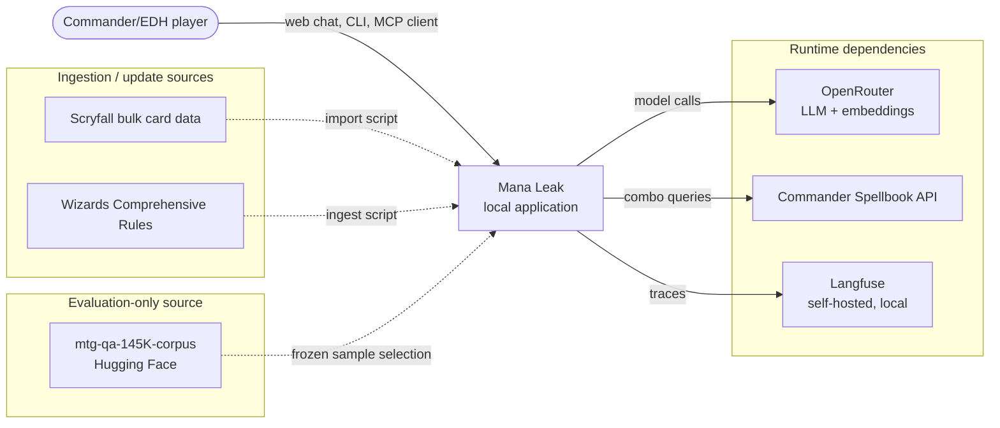
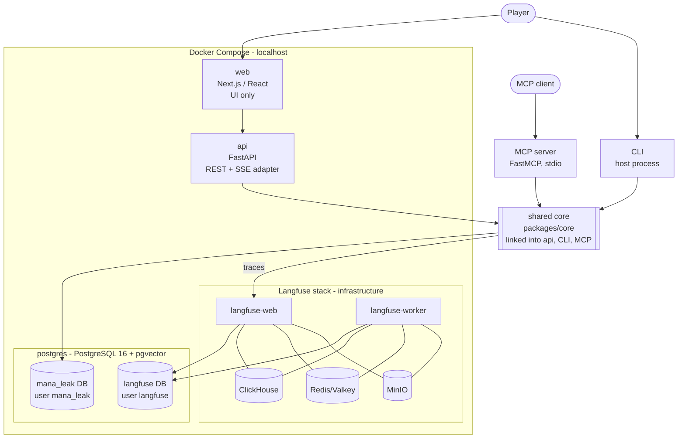
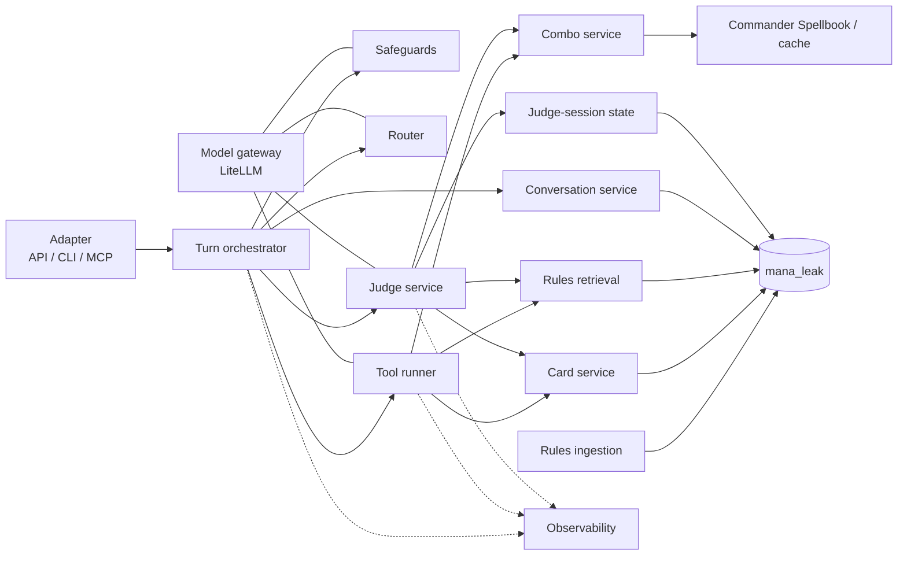
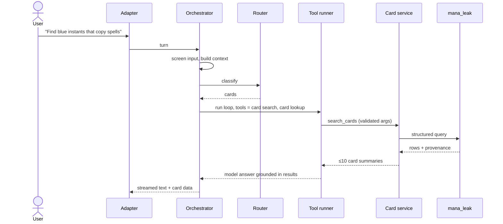
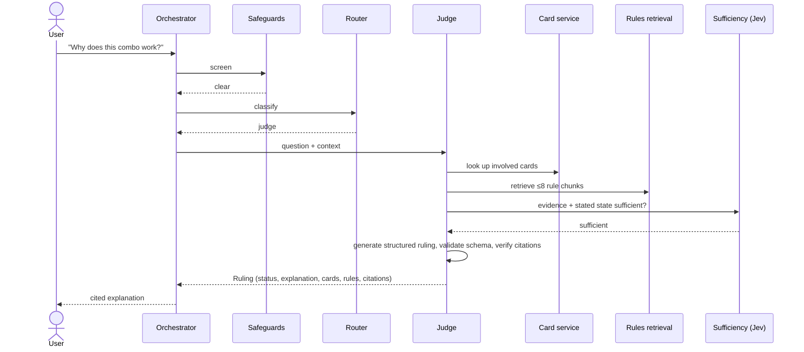
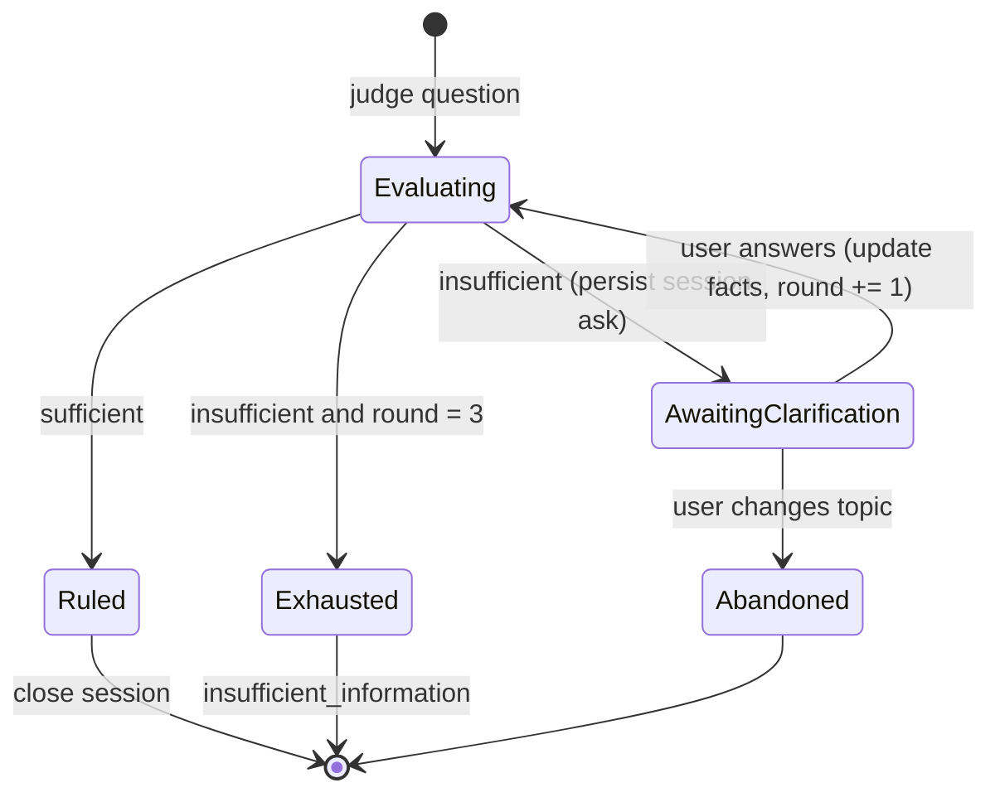
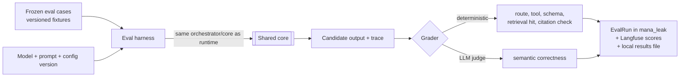
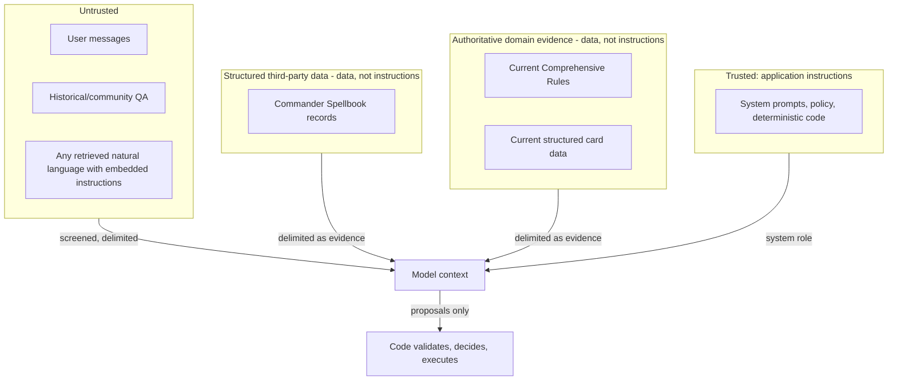

# Architecture

## Purpose

This document describes how Mana Leak is shaped: its parts, their responsibilities, how requests and data move between them, where trust boundaries sit, and what runs locally. It is the bridge between `vision.md` and the implementation documents. Table fields belong in `data-model.md`; interfaces, schemas, endpoints, and commands belong in `contracts.md`; ordering and acceptance criteria belong in `build-plan.md`.

## Scope and assumptions

- Local-only. The complete system runs on one machine via Docker Compose. There is no public deployment.
- Single user, no authentication. The stack binds to `127.0.0.1`.
- Python 3.12 managed as a `uv` workspace: `packages/core` (shared core) and `apps/api` (adapters). Next.js in `apps/web`.
- **Assumption:** the CLI and MCP server live in the `apps/api` package as separate entrypoints alongside FastAPI. This keeps one adapter package without adding a new top-level directory.

## System context



| Source | Role | When used |
|---|---|---|
| OpenRouter (via LiteLLM) | Chat completions and embeddings | Runtime and ingestion |
| Commander Spellbook | Known combo records | Runtime, with cached fixture fallback |
| Langfuse | Traces, sessions, eval scores | Runtime and eval; never on the critical answer path |
| Scryfall bulk data | Card records | Ingestion only; never queried live at runtime |
| Comprehensive Rules | Rules corpus | Ingestion only; never fetched at startup |
| MTG-QA corpus | Historical Q&A | Evaluation only; never runtime evidence |

## Container architecture



| Container | Responsibility | Must not |
|---|---|---|
| **web** | Render chat, stream assistant output, list and resume conversations, display structured rulings and citations. Talks only to the API. | Call models, databases, or external sources; contain domain logic. |
| **api** | HTTP adapter: streamed chat endpoint, REST endpoints for conversations, cards, combos, rules, and health. Translates HTTP to core calls and core results/events to HTTP/SSE. | Implement search, retrieval, routing, or judging. |
| **shared core** | All domain and application logic (below). A library, not a separate service. | Know about HTTP, SSE, CLI parsing, or MCP framing. |
| **CLI** | Thin command-line adapter over the core, used for demos, ingestion, and evals. Runs on the host (or via `docker compose exec api`). | Duplicate core logic. |
| **MCP server** | Thin FastMCP adapter exposing core capabilities as MCP tools. | Duplicate core logic or widen tool permissions. |
| **postgres** | One PostgreSQL 16 server with pgvector. `mana_leak` holds application state, cards, rules chunks, and embeddings. `langfuse` is owned by Langfuse. | Mix Langfuse and application tables. |
| **Langfuse stack** | Self-hosted tracing UI and ingestion. Its components follow the current official Langfuse Docker Compose for the pinned version. | Become an application dependency for answering. |

## Shared-core invariant

> **All domain capabilities exist once in the shared core. FastAPI, CLI, MCP, and LLM tool schemas are adapters around the same services.**

There is exactly one implementation each of card search, card lookup, combo search, combo finding, rules retrieval, and judging. An adapter may validate input, translate formats, and render output. It may not filter, rank, reason, or decide. A new interface adds an adapter, never a second implementation.

## Core components



**Turn orchestrator.** The single entrypoint for a conversational turn, used by every adapter. It sequences screening, context building, routing, the tool loop or judge, persistence, and tracing. It enforces the per-turn timeout and the model-call cap. It emits typed events (text deltas, tool activity, final structured result, errors) that adapters render; the API turns them into SSE.

**Model gateway.** A small wrapper over LiteLLM/OpenRouter used by every model call. It applies the model timeout, the structured-output retry, and the transient-failure retries, and attaches tracing metadata. Model identifiers come from configuration.

**Card service.** Deterministic structured search and exact lookup over local card data: name, Oracle text, type line, colour identity, mana value, keywords, Commander legality. Lookup resolves exact names first, then a deterministic fuzzy name match. Results carry source and version metadata. No model generates or rewrites card data, and card search does not use embeddings.

**Combo service.** Queries Commander Spellbook to find known combos involving supplied cards and to search combos. It returns structured pieces, prerequisites, steps, results, and the Spellbook record identifier. Responses may be cached in the application database; a versioned fixture set is the fallback. The model never presents a combo as "known" unless it came from this service.

**Rules ingestion.** An offline pipeline, run by command rather than at startup. It downloads the current Comprehensive Rules, parses them along the document's own hierarchy, chunks by rule, generates embeddings, and stores chunks with provenance. Re-ingestion replaces the indexed rule set for the new version. It is separate from runtime retrieval.

**Rules retrieval.** Runtime search over indexed rule chunks: pgvector semantic search, PostgreSQL full-text search, and direct lookup by rule number. It returns at most 8 chunks, each with a stable rule number and provenance for citation.

**Router.** Classifies a turn into exactly one of `cards`, `combos`, `judge`, or `other`. It produces a route label, not an answer. An active Judge session overrides routing: the turn goes to the judge as a clarification answer unless the user clearly abandons it.

**Tool runner.** The bounded tool-calling loop. It exposes only the route's allowlisted tools to the model, validates every tool call's arguments against its schema, executes the matching core service, shapes and truncates results, and returns failures to the model as structured tool errors instead of raising. It stops after 5 tool steps.

| Route | Tools exposed to the model |
|---|---|
| `cards` | card search, card lookup |
| `combos` | card lookup, combo find, combo search |
| `judge` | card lookup, rules search, combo find (only when the question concerns a known combo) |
| `other` | none |

**Judge service.** Produces rulings. It gathers card evidence and rules evidence (and combo records where relevant), runs a bounded sufficiency decision on whether the evidence and stated game state support a ruling, and either produces a validated structured ruling or asks for clarification. Ruling statuses are `legal`, `illegal`, `conditional`, and `insufficient_information`. After generation, code checks citations: every cited rule number, card, and combo must appear in the evidence actually retrieved for that turn. A ruling with an unverifiable citation is rejected (one regeneration attempt, then a controlled `insufficient_information`).

**Sufficiency decision (Jev role).** The "is this enough to rule?" step is the bounded decision where Jev is used. Its output is a small typed result: sufficient, or insufficient with a list of missing facts. Code owns the consequence. If Jev is unavailable, a local model call with the same output schema substitutes. Jev is never the source of the rules conclusion.

**Judge-session state.** A persisted record per active clarification workflow: the original question, known game-state facts, missing facts, clarification count, status, and the final ruling. Code owns all transitions. At most 3 clarification rounds; after that the session closes with `insufficient_information` and an explanation of what is missing.

**Conversation service.** Persists conversations and messages, supports resume after reload, and builds the bounded model context. The conversation ID is the Langfuse session ID and is attached to Judge sessions, rulings, and audit events.

**Safeguards.** Input screening (length cap, malformed input, a bounded classifier returning `clear`, `suspicious`, or `uncertain`), separation of instructions from data in prompts, tool allowlists, secret redaction in prompts, logs, and errors, and hard execution limits. Code decides the consequence of a screening result: continue, continue with heightened restriction, or refuse safely.

**Observability.** Langfuse tracing of each turn: route, screening result, model calls with token and cost metadata, tool calls and results, retrieval source IDs, Judge transitions, retries, and limit events. Critical events are also written as audit events in the application database, so they survive if Langfuse is down.

## Request flows

### Card lookup



### Combo

```text
User → router(combos) → tool runner → card lookup (resolve names)
     → combo find/search → Commander Spellbook (or cache/fixture)
     → ≤10 structured combos with record IDs → model explanation → response
```

### Rules judge



### Missing state



Code increments the clarification count and decides the transition; the model only proposes missing facts and clarification wording.

### Evaluation



The harness runs cases through the same core as production. Evaluation data flows in as inputs and expectations only; it never becomes runtime evidence.

## Trust boundaries



- Only application instructions occupy the system role. Everything else enters the prompt as clearly delimited data.
- Retrieved rules text, card text, and combo descriptions are evidence to reason over. Instructions found inside them are ignored.
- User messages are untrusted. Screening runs before routing. Oversized or malformed input is rejected by code without a model call.
- Model output is a proposal. Tool calls are validated against schemas and allowlists; rulings are validated against the schema and citation check before they reach the user.
- The model has no filesystem, shell, network, or database-write tools. All domain tools are read-only.
- Secrets live only in environment configuration. They are never placed in prompts, tool results, traces, or error messages.

## Source authority

```text
application policy/code
    >
current Comprehensive Rules
    >
current structured card data
    >
Commander Spellbook combo data
    >
historical/community/evaluation material
    >
model prior knowledge
```

Conflicts are resolved by rank. Code-enforced policy cannot be overridden by any content. A card's printed or Oracle text is applied through the rules (card text that contradicts a rule wins only where the rules themselves say so). A Spellbook combo description that conflicts with current card text or rules is reported as such rather than repeated. Historical QA never overrides current sources; in evaluation, such a disagreement marks the case as stale. Model prior knowledge is never cited and never presented as authoritative.

## Deterministic versus model-owned

| Owned by code | Owned by models |
|---|---|
| Input length and format validation | Interpreting natural-language questions |
| Pydantic validation of tool args and outputs | Route classification |
| Route tool allowlists | Choosing among allowed tools and proposing arguments |
| Database queries, exact and fuzzy card lookup | Synthesising retrieved evidence |
| Combo retrieval from structured data | Explaining combos and interactions |
| Citation verification against retrieved evidence | Proposing missing game-state facts and clarification questions |
| Judge-session transitions and clarification limit | Screening classification (bounded labels) |
| Retries, timeouts, step and call caps | Semantic grading where exact comparison is unsuitable |
| Result shaping and truncation | |
| Source and version metadata | |
| Persistence, audit events, failure handling | |

Mana Leak does **not** implement the MTG rules engine deterministically. The rules conclusion is model reasoning over retrieved evidence, bounded and checked by code.

## RAG architecture

```text
Comprehensive Rules (text release)
→ parse by rule hierarchy (section → rule → subrule; glossary separately)
→ chunk: one rule with its subrules; split oversized rules at subrule boundaries, repeating the parent rule text as context
→ embed (OpenRouter embedding model via LiteLLM)
→ store in mana_leak with pgvector + full-text index + provenance
→ retrieve: semantic + keyword + explicit rule-number lookup
→ merge and deduplicate, cap at 8
→ evidence to judge with stable rule numbers
```

- Rules are the only embedded corpus. Cards and combos are retrieved through structured queries.
- Retrieval combines semantic and keyword results with a simple merge. Reranking is added only if evaluation shows it is needed.
- Every chunk keeps its rule number, heading, source URL, rules version (effective date), and retrieval timestamp. Citations display the rule number.
- The embedding model is fixed per index. Changing it requires re-ingestion.

## Context management

Each model call receives only:

1. system/application instructions;
2. a conversation summary, when older turns exist;
3. the last 10 turns;
4. active Judge-session facts (question, known facts, missing facts);
5. the current user message;
6. current retrieved evidence and tool results.

When context grows too large, older turns are summarised and recent turns plus Judge facts are preserved. There is no long-term memory beyond persisted conversations.

## Operational boundaries

| Limit | Value | Enforced by |
|---|---:|---|
| Tool steps per turn | 5 | Tool runner |
| Model calls per turn (target / absolute) | 3 / 5 | Orchestrator |
| Structured-output retry | 1 | Model gateway |
| Transient external retries | 2 | Model gateway, combo service |
| External HTTP timeout | 10 s | HTTP clients |
| Model-call timeout | 30 s | Model gateway |
| Overall turn timeout | 60 s | Orchestrator |
| Rule chunks to model | 8 | Rules retrieval |
| Card results to model | 10 | Card service / tool runner |
| Combo results to model | 10 | Combo service / tool runner |
| Tool-result text | ~8,000 chars | Tool runner |
| Judge clarification rounds | 3 | Judge-session state |
| Active context | last 10 turns + summary | Conversation service |
| User message length | ~8,000 chars | Safeguards |
| Answer size target | ~1,500 tokens | Model gateway |
| Eval concurrency | 5 workers | Eval harness |

There is no monetary spend cap. Token and cost metadata are observed through Langfuse.

## Failure and degradation

Every failure produces a controlled result and an audit event; nothing hangs or crashes the turn.

| Failure | Behaviour |
|---|---|
| Commander Spellbook unavailable | Serve from cache, then from the versioned fixture set; the response states it is using cached data. |
| Embeddings / semantic search unavailable | Fall back to PostgreSQL full-text and rule-number lookup; the trace records the degraded mode. |
| Langfuse unavailable | Tracing becomes a no-op; answers continue; audit events still persist locally. |
| Source refresh unavailable | Use previously ingested card and rules data; startup never downloads sources. |
| Model error or timeout | Retry within limits, then a controlled error event to the user. |
| Invalid structured output | One retry, then a controlled failure (never unvalidated output). |
| Insufficient rules evidence | `insufficient_information` with an explanation; no ruling from model memory. |
| Tool error | Returned to the model as a structured tool result; the loop continues within limits. |
| Limit reached (steps, calls, timeout) | Stop, return the best supported partial answer or a controlled failure, record the limit event. |
| Jev unavailable | Local bounded substitute with the same output schema. |

## Local deployment

Docker Compose on `localhost` is the only deployment target. `docker compose up --build` with a populated `.env` starts the full stack.

- **postgres**: PostgreSQL 16 + pgvector, named volume, health check. An init script creates the `mana_leak` and `langfuse` databases with separate users and enables `vector` only in `mana_leak`.
- **api**: FastAPI, depends on a healthy `postgres`, and reaches it through the Compose network.
- **web**: Next.js standalone build; calls the API.
- **Langfuse**: `langfuse-web`, `langfuse-worker`, ClickHouse, Redis/Valkey, and MinIO, configured per the official Langfuse self-hosting Compose for the pinned version, using the `langfuse` database. This is the next infrastructure task; the current `docker-compose.yml` marks the slot.
- **CLI and MCP** run from the same Python environment as the API: on the host via `uv`, or inside the api container.
- Data import and rules ingestion are explicit commands run before the demo. Imported data persists in the named Postgres volume. Bulk downloads stay in the git-ignored `data/` directory.

## Data boundaries

| Data | Owner and source | Store |
|---|---|---|
| Cards | Imported from Scryfall bulk data | `mana_leak` |
| Combos | Commander Spellbook; optional cache plus versioned fixtures | Remote, `mana_leak` cache, `evals/fixtures` |
| Rule chunks and embeddings | Ingested Comprehensive Rules | `mana_leak` (pgvector) |
| Conversations and messages | Application | `mana_leak` |
| Judge sessions and rulings | Application | `mana_leak` |
| Audit events | Application | `mana_leak` |
| Eval cases | Frozen fixtures | `evals/fixtures` (versioned), loaded into `mana_leak` |
| Eval runs | Eval harness | `mana_leak` plus git-ignored `evals/results` |
| Traces | Langfuse | `langfuse` DB and Langfuse stores |

Fields, keys, and indexes are defined in `data-model.md`.

## Interface boundaries

- **Internal Python interfaces:** typed core service functions; the canonical contract that every adapter calls.
- **LLM tool schemas:** generated from the same Pydantic argument models as the core interfaces.
- **FastAPI:** REST for conversations and direct domain queries; a streaming chat endpoint over SSE compatible with the AI SDK `useChat` stream protocol.
- **CLI:** commands for search, combos, rules, judge, chat, ingestion, and evals.
- **MCP:** FastMCP tools mirroring the core tool set.

Exact signatures, schemas, endpoints, stream events, commands, and error shapes are defined in `contracts.md`.

## Evaluation architecture

Evaluation is a first-class part of the system but is separate from runtime authority. Suites are versioned fixtures selected deterministically (fixed seed) and kept frozen:

| Suite | Size |
|---|---:|
| Smoke (10 MTG-QA, 5 current-rules, 5 routing/tool, 5 adversarial) | 25 |
| MTG-QA development | 200 |
| MTG-QA held-out (final evaluation only) | 100 |
| Current-rules gold | 20 |
| Retrieval | 20 |
| Router/tool | 20 |
| Adversarial/safeguard | 15 |
| Stateful Judge mode | 10 |

The harness records model, prompt, and configuration versions with every run, so results are comparable. Gates, scoring, and run cadence are defined in `build-plan.md`.

## Architectural decisions

**Shared Python core**
- *Decision:* All domain logic lives in `packages/core`; API, CLI, MCP, and tool schemas are adapters.
- *Rationale:* One implementation to test and evaluate; four required interfaces in 24 hours.
- *Consequence:* Adapters stay thin; any logic found in an adapter is a defect.

**PostgreSQL + pgvector**
- *Decision:* One relational store for application state, cards, rule chunks, and embeddings.
- *Rationale:* One system to run and back up; hybrid semantic and keyword search in one query layer.
- *Consequence:* No dedicated vector database or search engine.

**Structured card queries, not card RAG**
- *Decision:* Cards are searched with structured SQL; only rules are embedded.
- *Rationale:* Card questions have exact answers; embeddings add cost and fuzziness.
- *Consequence:* Search covers defined fields, not arbitrary semantic card discovery.

**Rules RAG, not a rules engine**
- *Decision:* The model reasons over retrieved Comprehensive Rules; code verifies citations and bounds the workflow.
- *Rationale:* A deterministic rules engine is out of scope; retrieval keeps answers current and citable.
- *Consequence:* Correctness depends on retrieval quality and evaluation, not formal proof.

**Local Docker Compose only**
- *Decision:* The complete stack runs locally via Compose.
- *Rationale:* The completion target is a clean local start.
- *Consequence:* No cloud, TLS, auth, or production operations work.

**One PostgreSQL server, separate databases**
- *Decision:* The `mana_leak` and `langfuse` databases with separate users share one server.
- *Rationale:* One fewer container; clean ownership.
- *Consequence:* Langfuse migrations never touch application tables.

**Route-specific tool allowlists**
- *Decision:* Each route exposes only its tools; code rejects any other tool call.
- *Rationale:* Least privilege and more reliable tool choice.
- *Consequence:* Cross-route questions are handled by routing, not by widening tool sets.

**Current evidence separated from frozen evaluation data**
- *Decision:* Runtime knowledge (cards, rules) refreshes independently; eval suites are frozen and never used as evidence.
- *Rationale:* Prevents stale answers from overriding current rules, and keeps evaluations comparable.
- *Consequence:* Historical cases that disagree with current rules are classified as stale, not "fixed".

## Constraints

The architecture must be buildable by one developer in 24 hours. Do not introduce:

- microservices, message queues, event buses, or background workers (other than Langfuse's own);
- authentication or user accounts;
- caching infrastructure beyond a database table;
- additional application databases, Elasticsearch/OpenSearch, or vector databases;
- agent frameworks; the tool loop is plain code over LiteLLM;
- abstraction layers without a second concrete use.

If something can be a function in the shared core, it is a function in the shared core.

## Open issues

- Exact Langfuse versions and supporting-service configuration are fixed when the Langfuse Compose task is done.
- Embedding and chat model identifiers are configuration; defaults are chosen in `contracts.md`.
- The Jev integration mechanism (external service or library) is confirmed during the judge milestone; the local substitute keeps the architecture unchanged either way.
