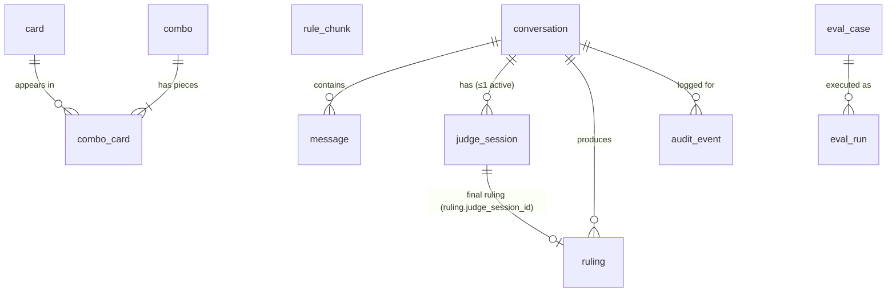

# Data Model

## Purpose

This document defines the persistent data Mana Leak needs: entities, required fields, relationships, ownership, constraints, indexes, provenance, and lifecycle. It is enough to write SQLModel models and create the schema without making further data-design decisions. API shapes and Pydantic contracts live in `contracts.md`; component responsibilities live in `architecture.md`.

## Scope and assumptions

- Platform: PostgreSQL 16 with pgvector, in the `mana_leak` database owned by the `mana_leak` user. Implemented with SQLModel/SQLAlchemy.
- Single local user. No user, account, or permission entities.
- Knowledge data (cards, combos, rules) is re-importable from sources or fixtures. Conversation and eval data is the only state that is costly to lose.
- **Assumption:** the `vector` extension is created by the Postgres init script (it needs superuser). `pg_trgm` is a trusted extension, so the application creates it during schema setup as the database owner.

## Entity overview



| Group | Tables | Nature |
|---|---|---|
| Knowledge | `card`, `combo`, `combo_card`, `rule_chunk` | Imported/cached external data; replaced on refresh |
| Conversation and judge | `conversation`, `message`, `judge_session`, `ruling` | Application state; persists until cleared |
| Evaluation | `eval_case`, `eval_run` | Frozen inputs (canonical in git) and append-only results |
| Audit | `audit_event` | Critical events, independent of Langfuse |

`combo_card` is the only supporting entity added. It makes "find combos containing these cards" a single indexed join.

## Conventions

- Table and column names are `snake_case`; table names are **singular** (`card`, `message`).
- Primary keys are UUIDs (`uuid`, generated by the application) except where a stable upstream identifier is the natural key (`card.oracle_id`, `combo.id`, `eval_case.id`).
- All timestamps are `timestamptz` in UTC. `created_at` defaults to `now()`.
- Upstream identifiers are stored exactly as the source provides them.
- Enumerated values are stored as `text` with a `CHECK` constraint (simpler to migrate than PostgreSQL enum types).
- Lists of simple scalars use native `text[]` arrays (easy `@>`/`&&` queries). Nested or variable structures use `jsonb`.

### Provenance fields

Every externally sourced table carries these columns directly; there is no shared `source` table:

| Column | Type | Meaning |
|---|---|---|
| `source` | text, not null | `scryfall`, `commander_spellbook`, `comprehensive_rules`, `mtg_qa`, or `hand_authored` |
| `source_id` | text, null | Upstream record identifier (when distinct from the primary key) |
| `source_url` | text, null | Canonical URL of the record or document |
| `source_version` | text, not null | Upstream version: bulk-data `updated_at`, rules effective date, dataset revision, or `fixture-<date>` |
| `retrieved_at` | timestamptz, not null | When Mana Leak fetched or imported it |

Importers must fail rather than write external data without `source`, `source_version`, and `retrieved_at`.

## Knowledge data

### `card`

One row per logical Oracle card (Scryfall `oracle_id`), not per printing. Imported from the Scryfall *Oracle Cards* bulk file. Import excludes non-game objects (layouts `token`, `double_faced_token`, `emblem`, `art_series`, `vanguard`, `scheme`, `planar`).

**`oracle_id` is the stable logical-card key.** Print-specific Scryfall `id`s are not stored.

| Column | Type | Null | Notes |
|---|---|---|---|
| `oracle_id` | uuid | PK | Scryfall `oracle_id` |
| `name` | text | no | Canonical full name; multi-face names use ` // ` (`"Fable of the Mirror-Breaker // Reflection of Kiki-Jiki"`) |
| `name_normalized` | text | no | Lowercased, accent-folded, punctuation-stripped full name for exact matching |
| `face_names_normalized` | text[] | no | Normalised name of each face (lets "Reflection of Kiki-Jiki" resolve) |
| `layout` | text | no | Scryfall layout (`normal`, `transform`, `modal_dfc`, `split`, `adventure`, …) |
| `mana_cost` | text | yes | Front-face or combined cost as Scryfall reports it |
| `mana_value` | numeric(5,1) | no | Scryfall `cmc` (numeric because of half-mana Un-cards) |
| `type_line` | text | no | Full type line, faces joined with ` // ` |
| `oracle_text` | text | no | All faces' Oracle text, faces separated by `\n//\n`; empty string if none |
| `colors` | text[] | no | e.g. `{U,R}`; union of faces |
| `color_identity` | text[] | no | e.g. `{U,R}` |
| `keywords` | text[] | no | Scryfall `keywords` |
| `power`, `toughness`, `loyalty` | text | yes | Front face values, as strings (`*`, `1+*`) |
| `faces` | jsonb | yes | For multi-face layouts: array of `{name, mana_cost, type_line, oracle_text, power, toughness, loyalty}`; null for single-face |
| `legal_commander` | text | no | Scryfall `legalities.commander`: `legal`, `not_legal`, `banned`, `restricted` |
| `scryfall_uri` | text | no | Link for display |
| `search_tsv` | tsvector | no | Generated column: `to_tsvector('english', name || ' ' || type_line || ' ' || oracle_text)` |
| provenance | | | `source='scryfall'`, `source_id` = Scryfall card `id` of the representative printing, `source_url`, `source_version` = bulk `updated_at`, `retrieved_at` |
| `imported_at` | timestamptz | no | When this row was last upserted |

Not stored: prices, printings, sets, artwork, rulings text, ownership, EDHREC data.

### `combo`

One row per Commander Spellbook variant (the record users see as a combo). Cached on first fetch and from fixture loads; upserted by `id`.

| Column | Type | Null | Notes |
|---|---|---|---|
| `id` | text | PK | Spellbook variant identifier exactly as returned (e.g. `"1414-2730"`) |
| `color_identity` | text[] | no | e.g. `{U,R}` |
| `prerequisites` | jsonb | no | Array of strings (easy and notable prerequisites as Spellbook provides them, each prefixed with its kind) |
| `steps` | jsonb | no | Ordered array of strings |
| `results` | jsonb | no | Array of strings (the "produces" features, e.g. `"Infinite copies of Kiki-Jiki"`) |
| `legal_commander` | boolean | yes | Spellbook legality flag when present |
| `card_names` | text[] | no | Canonical names of pieces, denormalised for display |
| `templates` | jsonb | yes | Spellbook `requires[]` template placeholders (non-card requirements such as "any creature with haste"); stored as a `jsonb` array of template-name strings (`list[str]`, matching `Combo.templates` in `contracts.md`), not reduced to card names; null when the variant has no templates |
| provenance | | | `source='commander_spellbook'`, `source_url` = combo page URL, `source_version` = Spellbook bulk `version` string (falling back to `retrieved_at`'s date) for live fetches, `fixture-<date>` for fixture loads, `retrieved_at` |

Not stored: Spellbook popularity/deck counts, prices, and variant-of/alias graphs.

### `combo_card`

Membership of cards in combos. Spellbook can reference a card that is missing from the local card table (new set, import lag), so the local foreign key is nullable and the name is always kept.

| Column | Type | Null | Notes |
|---|---|---|---|
| `combo_id` | text | no | FK → `combo.id`, `ON DELETE CASCADE` |
| `card_name` | text | no | Canonical card name as Spellbook gives it |
| `card_name_normalized` | text | no | Same normalisation as `card.name_normalized` |
| `oracle_id` | uuid | yes | FK → `card.oracle_id`, `ON DELETE SET NULL`; resolved at upsert from the live response's `uses[].card.oracleId`, falling back to normalised-name lookup for cache/fixture records without it |
| `quantity` | smallint | no | Default 1 |
| `zone_locations` | text[] | yes | Spellbook starting zones (e.g. `{B}` battlefield, `{H}` hand) |

Primary key: (`combo_id`, `card_name_normalized`).

"Combos containing all of cards X, Y" is `GROUP BY combo_id HAVING count(*) = n` over `combo_card` filtered by `card_name_normalized`. Lookup goes by normalised name, so unresolved `oracle_id`s do not break combo search.

### `rule_chunk`

Indexed Comprehensive Rules. Rules are the only embedded corpus.

**Chunking-to-row rules:**

- A chunk normally covers one numbered rule (e.g. `702.19`) with all its subrules (`702.19a`–`702.19e`). `rule_number` is that rule; `subrule_numbers` lists what the chunk contains.
- If a rule with its subrules exceeds the size limit (about 1,500 tokens), it is split at subrule boundaries into consecutive parts. Each part repeats the parent rule's own text as a header, has the same `rule_number`, and has `part` = 1, 2, …. A citation always names the specific subrule (e.g. `702.19c`), which must appear in some chunk's `subrule_numbers` or as its `rule_number`. Citations stay stable no matter how the rule was split.
- Section headings (e.g. `702. Keyword Abilities`) are stored as context in `section_number`/`section_title`, not as separate chunks.
- Each glossary entry becomes a chunk with `kind='glossary'`, `rule_number` = `glossary:<term>`.

| Column | Type | Null | Notes |
|---|---|---|---|
| `id` | uuid | PK | |
| `rules_version` | text | no | Effective date of the rules document, `YYYY-MM-DD` (also `source_version`) |
| `kind` | text | no | `rule` or `glossary` |
| `rule_number` | text | no | e.g. `702.19`, `glossary:Trample` |
| `part` | smallint | no | 1 unless split |
| `subrule_numbers` | text[] | no | e.g. `{702.19a,702.19b}`; empty for glossary |
| `parent_rule_number` | text | yes | e.g. `702` for `702.19` |
| `section_number` | text | no | e.g. `702`; glossary uses `glossary` |
| `section_title` | text | no | e.g. `Keyword Abilities` |
| `text` | text | no | Chunk text exactly as in the rules (plus the repeated parent header for parts > 1) |
| `embedding` | vector(*n*) | yes | *n* fixed by the configured embedding model; null if embedding failed (keyword search still works) |
| `embedding_model` | text | yes | Model identifier that produced `embedding` |
| `search_tsv` | tsvector | no | Generated: `to_tsvector('english', rule_number || ' ' || section_title || ' ' || text)` |
| provenance | | | `source='comprehensive_rules'`, `source_url` = rules TXT URL, `source_version` = `rules_version`, `retrieved_at` |

Unique: (`rules_version`, `rule_number`, `part`).

The embedding dimension is a schema parameter chosen with the embedding model in configuration. Changing models means recreating the column and re-ingesting.

## Conversation and judge state

### `conversation`

| Column | Type | Null | Notes |
|---|---|---|---|
| `id` | uuid | PK | Also used as the Langfuse session ID |
| `title` | text | yes | Short title, set from the first user message |
| `summary` | text | yes | Rolling summary of turns older than the last 10 |
| `summary_through_seq` | integer | yes | Highest `message.seq` included in `summary` |
| `created_at`, `updated_at` | timestamptz | no | `updated_at` bumped on each new message |

No status column: a conversation is open until deleted. Judge Mode state lives in `judge_session`.

### `message`

| Column | Type | Null | Notes |
|---|---|---|---|
| `id` | uuid | PK | |
| `conversation_id` | uuid | no | FK → `conversation.id`, `ON DELETE CASCADE` |
| `seq` | integer | no | Monotonic within conversation, starting at 1 |
| `turn_id` | uuid | no | Groups one user message with its responses; shared with audit events and traces |
| `role` | text | no | `user`, `assistant`, `tool` |
| `content` | text | no | Display text (user input, assistant answer, or a one-line tool summary) |
| `payload` | jsonb | yes | Structured data: for `assistant`, the `TurnResult` JSON (`CardsResult`, `CombosResult`, `Ruling`, `RulesExplanation`, `RuleText`, or `NeedMoreInformation`, per `contracts.md`); a `Ruling`/`RulesExplanation` payload duplicates the matching `ruling` row (`kind='ruling'`/`kind='explanation'`) by design, for display without a join; `RuleText` is payload only — deterministic rule-text lookups are never written to `ruling`; for `tool`, `{tool, args, ok, result_ids, error}` |
| `route` | text | yes | Route chosen for the turn (`cards`, `combos`, `judge`, `other`); set on the assistant message |
| `created_at` | timestamptz | no | |

Unique: (`conversation_id`, `seq`).

**Tool messages** are persisted so that a resumed conversation can rebuild the last 10 turns with what the model actually saw. They store validated arguments and the IDs of returned records (oracle IDs, combo IDs, rule numbers), not the full tool output. Records can be re-fetched by ID. System prompts are not persisted as messages.

### `judge_session`

| Column | Type | Null | Notes |
|---|---|---|---|
| `id` | uuid | PK | |
| `conversation_id` | uuid | no | FK → `conversation.id`, `ON DELETE CASCADE` |
| `status` | text | no | `active`, `completed`, `exhausted`, `abandoned` |
| `question` | text | no | Original user question that opened the session |
| `known_facts` | jsonb | no | Array of `{fact, source_turn_id}`, the game-state facts established so far |
| `missing_facts` | jsonb | no | Array of strings: facts still needed; max 3 (matches `SufficiencyDecision.missing_facts` and `NeedMoreInformation`), each surfaced as a clarification question |
| `clarification_count` | smallint | no | Default 0; capped in code by `JUDGE_MAX_CLARIFICATIONS` (config, default 3); `CHECK (clarification_count BETWEEN 0 AND 3)` is a fixed upper-bound backstop, independent of the configured value |
| `card_oracle_ids` | uuid[] | no | Cards identified for the question so far |
| `created_at`, `updated_at` | timestamptz | no | |
| `closed_at` | timestamptz | yes | Set on any terminal status |

One active session per conversation: partial unique index on (`conversation_id`) `WHERE status = 'active'`.

A session's final ruling is the `ruling` row whose `judge_session_id` points to it; `judge_session` holds no reference back to `ruling`.

Transitions (`active → completed | exhausted | abandoned`) and the `JUDGE_MAX_CLARIFICATIONS` round limit (default 3) are enforced in code; the `CHECK (0–3)` is a fixed backstop that does not move with the configured value — an emergency override (e.g. capping at 1) changes the setting, not the schema.

### `ruling`

The structured judge output: legality rulings and rules explanations share this table, distinguished by `kind`. It holds the displayed explanation and *references* to evidence, not copies of the source records. `RuleText` (exact-rule-text lookups) is never stored here — see `message.payload`.

| Column | Type | Null | Notes |
|---|---|---|---|
| `id` | uuid | PK | |
| `kind` | text | no | `ruling` (legality verdict) or `explanation` (`RulesExplanation`, R2-6); `CHECK (kind IN ('ruling','explanation'))` |
| `conversation_id` | uuid | no | FK → `conversation.id`, `ON DELETE CASCADE` |
| `judge_session_id` | uuid | yes | FK → `judge_session.id`, `ON DELETE SET NULL`; unique when non-null (at most one final ruling per session); null for rulings/explanations without an associated Judge session (always null before M7, when `judge_session` is introduced) |
| `turn_id` | uuid | no | Turn that produced the ruling |
| `question` | text | no | Question as ruled on (original question plus established facts) |
| `status` | text | yes | `legal`, `illegal`, `conditional`, `insufficient_information` when `kind='ruling'`; always null when `kind='explanation'` (`RulesExplanation` has no status field) |
| `summary` | text | no | One- or two-sentence outcome |
| `explanation` | text | no | Displayed explanation |
| `assumptions` | jsonb | no | Array of strings |
| `missing_information` | jsonb | no | Array of strings; non-empty when `status='insufficient_information'` (`kind='ruling'`, from M6) or when a `kind='explanation'` row can't fully answer the question from available evidence (`kind='explanation'` has no `status`, so this is how pre-M6 insufficiency is expressed — DOC-203); empty otherwise |
| `card_oracle_ids` | uuid[] | no | Cards involved |
| `rule_numbers` | text[] | no | Cited rule/subrule numbers, e.g. `{702.19c,613.1}` |
| `citations` | jsonb | no | Array of evidence references (below); empty only for a `kind='explanation'` row with non-empty `missing_information` — insufficient evidence to cite anything (DOC-203) |
| `rules_version` | text | yes | Rules version the cited rule chunks came from |
| `card_source_version` | text | yes | Card import version used |
| `model` | text | no | Model identifier that generated the ruling |
| `prompt_version` | text | no | Judge prompt version identifier |
| `trace_id` | text | yes | Langfuse trace ID |
| `created_at` | timestamptz | no | |

**Citation reference** (one element of `citations`):

```json
{ "type": "rule",  "ref": "702.19c", "chunk_id": "<rule_chunk.id>", "quote": "<≤300 chars>", "rules_version": "<rule_chunk.rules_version>" }
{ "type": "card",  "ref": "<oracle_id>", "name": "Kiki-Jiki, Mirror Breaker", "source_version": "<card.source_version>" }
{ "type": "combo", "ref": "<combo.id>", "source_version": "<combo.source_version>" }
```

`type` is one of `rule`, `card`, `combo`. `ref` must identify a record that was retrieved during the producing turn; the application verifies this before saving (see `architecture.md`). `rules_version` (rule citations) and `source_version` (card/combo citations) record the version in force when that citation was made, independent of the ruling-level `rules_version`/`card_source_version` columns. The short `quote` lets a ruling be shown and audited even after the rules index is replaced; full card or rule text is not copied.

Three layers stay distinct: `summary`/`explanation` (what the user reads), `rule_numbers`/`card_oracle_ids`/`citations` (structured references), and `card`/`rule_chunk`/`combo` (the source data).

Rulings and explanations are immutable. A corrected answer creates a new row.

## Evaluation data

**Canonical representation:** eval cases are versioned JSONL files under `evals/fixtures/` (one file per suite). The database `eval_case` table is a loaded copy for joins and reporting, upserted from the files by `id`. If they disagree, the file wins.

### `eval_case`

| Column | Type | Null | Notes |
|---|---|---|---|
| `id` | text | PK | Stable case ID, e.g. `mtgqa-dev-0042`, `rules-gold-007`, `adv-003` |
| `suite` | text | no | `mtg_qa`, `current_rules`, `retrieval`, `routing_tool`, `adversarial`, `judge_mode` |
| `split` | text | no | `smoke`, `dev`, `held_out`, `gold` |
| `input` | jsonb | no | `{question}` or, for multi-turn Judge cases, `{turns: [..]}` |
| `expected` | jsonb | no | Suite-specific expected output or properties (e.g. `{answer}`, `{status}`, `{route, tools}`, `{rule_numbers}`, `{must_refuse: true}`) |
| `expected_evidence` | jsonb | yes | `{rule_numbers: [...], oracle_ids: [...], combo_ids: [...]}` where relevant |
| `critical` | boolean | no | Default false; true for cases that are hard gates (critical adversarial) |
| `stale` | boolean | no | Default false; set when current rules contradict a historical expected answer |
| `metadata` | jsonb | no | Selection seed, original corpus row ID, notes |
| provenance | | | `source` (`mtg_qa` or `hand_authored`), `source_id` (corpus row ID), `source_url`, `source_version` (dataset revision or authoring date), `retrieved_at` |
| `frozen_at` | timestamptz | no | When the case was selected/frozen |

A case belongs to one split. A smoke case that is also used elsewhere gets its own ID in each suite. Held-out cases are protected by convention: they live in a separate fixture file (`mtg_qa.held_out.jsonl`) and the harness only runs them when asked explicitly. There is no access control.

`expected` is never edited after freezing. A case that turns out to be stale gets `stale = true` and an explanation in `metadata`.

### `eval_run`

Append-only. One row per case execution; a group of rows sharing `run_group_id` is one suite run.

| Column | Type | Null | Notes |
|---|---|---|---|
| `id` | uuid | PK | |
| `run_group_id` | uuid | no | Identifies the suite run |
| `eval_case_id` | text | no | FK → `eval_case.id`, `ON DELETE RESTRICT` |
| `started_at` | timestamptz | no | |
| `latency_ms` | integer | yes | |
| `model` | text | no | Primary model identifier |
| `prompt_version` | text | no | |
| `config` | jsonb | no | Other settings: router/embedding/grader models, limits, `rules_version`, `card_source_version` |
| `app_version` | text | yes | Git commit SHA when available |
| `output` | jsonb | yes | Candidate output (route, tools called, structured result, final text) |
| `scores` | jsonb | no | `{schema_valid, route_correct, tool_success, retrieval_hit, citation_valid, citation_relevant, semantic_correct, safeguard_pass, judge_flow_ok}`; keys present only where applicable; values boolean or 0–1; see `contracts.md` → Evaluation contracts for how each score (e.g. `citation_relevant`) is computed and which suites set it |
| `grader` | jsonb | yes | LLM-grader model, verdict, rationale |
| `passed` | boolean | no | Case-level pass by the suite's rule; per-suite pass rules are defined in `contracts.md` → Evaluation contracts |
| `error` | jsonb | yes | `{type, message}` for unhandled exceptions or controlled failures |
| `usage` | jsonb | yes | `{prompt_tokens, completion_tokens, cost_usd}` when available |
| `trace_id` | text | yes | Langfuse trace ID |

Aggregate metrics are calculated from rows when needed and are not stored. A summary JSON per run group may also be written to the git-ignored `evals/results/`.

## Audit data

### `audit_event`

Critical events kept locally so behaviour can be reconstructed when Langfuse is unavailable. It is not a log sink: no token deltas, no full prompts, no duplicate traces.

| Column | Type | Null | Notes |
|---|---|---|---|
| `id` | uuid | PK | |
| `conversation_id` | uuid | yes | FK → `conversation.id`, `ON DELETE CASCADE`; null for CLI/MCP calls without a conversation |
| `turn_id` | uuid | yes | |
| `event_type` | text | no | See below |
| `severity` | text | no | `info`, `warning`, `error` |
| `details` | jsonb | no | Small structured object, secrets redacted (e.g. `{label: "suspicious"}`, `{route: "judge"}`, `{tool, reason}`, `{from, to}`, `{limit, value}`) |
| `created_at` | timestamptz | no | |

`event_type` values: `screening_result`, `route_selected`, `tool_rejected`, `tool_failed`, `timeout`, `retry_exhausted`, `limit_reached`, `judge_transition`, `citation_validation_failed`, `structured_output_invalid`, `dependency_degraded`. New types are added in code (no `CHECK`), and documented in `contracts.md`.

## Relationships and deletion

| Relationship | Cardinality | On delete of parent |
|---|---|---|
| `conversation` → `message` | 1:N | cascade |
| `conversation` → `ruling` | 1:N | cascade |
| `conversation` → `judge_session` | 1:N overall, 0:1 active | cascade |
| `conversation` → `audit_event` | 1:N | cascade |
| `judge_session` → `ruling` (final) | 1 → 0..1, via `ruling.judge_session_id` (unique when non-null) | session delete sets `ruling.judge_session_id` null |
| `combo` ↔ `card` via `combo_card` | N:M | combo delete cascades to `combo_card`; card delete sets `combo_card.oracle_id` null |
| `eval_case` → `eval_run` | 1:N | restrict (runs are history) |

Deleting a conversation removes only conversation state. Knowledge tables are never referenced through cascading foreign keys from conversation data: `ruling.card_oracle_ids`, `rule_numbers`, and `citations` are plain values, not FKs, so card and rule refreshes never cascade into rulings, and conversation deletes never touch knowledge.

## Indexes

Only these indexes are required. Add more only if a measured query needs them.

| Table | Index | Purpose |
|---|---|---|
| `card` | PK `oracle_id` | Exact lookup by ID |
| `card` | btree `name_normalized` | Exact name lookup |
| `card` | GIN `face_names_normalized` | Face-name lookup |
| `card` | GIN trigram (`pg_trgm`) on `name_normalized` | Fuzzy name match / typo tolerance |
| `card` | GIN `search_tsv` | Text search over name/type/Oracle text |
| `card` | GIN `color_identity` | Colour-identity subset filters |
| `combo` | PK `id` | Lookup by Spellbook ID |
| `combo_card` | PK (`combo_id`, `card_name_normalized`); btree `card_name_normalized`; btree `oracle_id` | Find combos by card |
| `rule_chunk` | unique (`rules_version`, `rule_number`, `part`) | Rule identity |
| `rule_chunk` | btree `rule_number`; GIN `subrule_numbers` | Direct rule/subrule lookup |
| `rule_chunk` | GIN `search_tsv` | Keyword retrieval |
| `message` | unique (`conversation_id`, `seq`) | Ordered history |
| `conversation` | btree `updated_at DESC` | Recent conversations list |
| `judge_session` | partial unique (`conversation_id`) `WHERE status='active'` | One active session; fast active lookup |
| `ruling` | unique (`judge_session_id`) `WHERE judge_session_id IS NOT NULL` | At most one final ruling per session; session → ruling lookup |
| `ruling` | btree (`conversation_id`, `created_at`) | Rulings per conversation |
| `eval_case` | btree (`suite`, `split`) | Select suite |
| `eval_run` | btree (`run_group_id`); btree (`eval_case_id`, `started_at`) | Run reports, case history |
| `audit_event` | btree (`conversation_id`, `created_at`); btree (`event_type`, `created_at`) | Conversation audit, event queries |

**Vector index:** none initially. The rules corpus is a few thousand chunks, so exact cosine search (`embedding <=> :q`) is fast enough and avoids recall loss. If retrieval latency exceeds about 100 ms, add HNSW (`vector_cosine_ops`).

Commander legality is not indexed: it is a low-cardinality filter applied together with indexed predicates.

## Constraints and integrity

| Rule | Enforcement |
|---|---|
| Upstream IDs unique within source | PKs on `card.oracle_id`, `combo.id`; unique on `rule_chunk` identity; PK on `eval_case.id` |
| One active Judge session per conversation | Partial unique index |
| At most one ruling per Judge session | Partial unique index on `ruling.judge_session_id` where non-null |
| `clarification_count` between 0 and 3 | `CHECK` (fixed backstop); code enforces the configured `JUDGE_MAX_CLARIFICATIONS` (default 3) |
| `ruling.kind` ∈ {`ruling`, `explanation`} | `CHECK` |
| `ruling.status` ∈ {`legal`, `illegal`, `conditional`, `insufficient_information`} or null | `CHECK` |
| `ruling.kind='ruling' ⇔ status IS NOT NULL` | `CHECK` |
| `judge_session.status` ∈ {`active`, `completed`, `exhausted`, `abandoned`} | `CHECK` |
| `message.role` ∈ {`user`, `assistant`, `tool`} | `CHECK` |
| `eval_case.suite` and `split` in known values | `CHECK` |
| `rule_chunk.kind` ∈ {`rule`, `glossary`} | `CHECK` |
| `audit_event.severity` ∈ {`info`, `warning`, `error`} | `CHECK` |
| Provenance present on external data | `NOT NULL` on `source`, `source_version`, `retrieved_at` |
| `missing_information` empty unless `status='insufficient_information'` (`kind='ruling'`) or the row is a `kind='explanation'` with insufficient evidence (DOC-203) | Application validation (Pydantic) |
| Citations reference evidence retrieved in the producing turn | Application validation before insert |
| `terminal status ⇔ closed_at set` | Application code |

## JSONB and arrays

| Use | Type | Why |
|---|---|---|
| Colours, colour identity, keywords, face names, combo card names, subrule numbers, ruling rule numbers/card IDs | `text[]` / `uuid[]` | Simple containment queries, GIN-indexable |
| Card faces | `jsonb` | Variable per layout; displayed, not queried |
| Combo prerequisites/steps/results/templates | `jsonb` | Ordered display lists of strings; never filtered |
| Judge known/missing facts | `jsonb` | Small evolving lists owned by code |
| Ruling assumptions, missing information, citations | `jsonb` | Structured, displayed, validated in code |
| Message payload | `jsonb` | Varies by result type |
| Eval input/expected/scores/config/output | `jsonb` | Suite-specific shapes; avoids per-suite tables |
| Audit details | `jsonb` | Varies by event type |

Relationships (conversation, session, ruling, combo membership, eval case) are always real columns and FKs, never JSON.

## Versioning

| Data | Behaviour |
|---|---|
| Cards | Each import upserts by `oracle_id`, sets `source_version` to the bulk file's `updated_at`, and deletes rows absent from the new file. No history. |
| Combos | Upsert by `combo.id`, replacing that combo's `combo_card` rows; `retrieved_at` updated. Fixture loads use `source_version = fixture-<date>`. |
| Rules | Ingestion of a new version inserts all chunks for the new `rules_version` and deletes chunks of other versions **in one transaction**. Exactly one version is indexed at a time. Re-ingesting the same version replaces it. |
| Conversations/rulings | Append-only in practice; corrections are new messages/rulings. |
| Eval cases | Frozen. Only `stale` and `metadata` may change after freezing. |
| Eval runs | Append-only. |

Rulings keep `rules_version`, `card_source_version`, rule numbers, and short quotes, so a past ruling stays interpretable after a refresh.

## Retention

- Knowledge, conversations, rulings, eval data, and audit events persist in the `postgres-data` Docker volume.
- Conversations persist until deleted. Eval runs and audit events are pruned manually if needed.
- Bulk downloads (Scryfall JSON, rules TXT, raw MTG-QA data) live under git-ignored `data/`.
- Langfuse manages its own retention in its own stores.
- No automatic retention jobs.

## Not persisted

- API keys, secrets, or credentials (environment only).
- Full raw model prompts: the app DB stores no prompts; self-hosted Langfuse stores generation input/output in its own local ClickHouse/MinIO stores (no Cloud fallback); secrets never enter prompts.
- Streaming token deltas.
- Complete raw external HTTP responses (only the mapped fields above).
- Filesystem or shell data.
- Model-generated "knowledge" (no table stores model-asserted card, combo, or rule facts).
- EDHREC, pricing, popularity, collection, deck, or user data.

## Application and Langfuse separation

- All Mana Leak tables live only in the `mana_leak` database.
- Langfuse owns the `langfuse` database (and its ClickHouse/MinIO stores). The application never connects to it.
- The application interacts with Langfuse only through the Langfuse SDK/API. It stores Langfuse `trace_id`s as opaque strings and uses `conversation.id` as the session ID.

## Migration approach

**Decision:** Alembic from the start, using autogenerate from the SQLModel metadata, with a single initial migration created in M1 and one further migration per milestone that introduces or changes tables.

**Sequencing:** M1's initial migration creates `conversation`, `message`, and `audit_event` — the walking-skeleton scope (Docker Compose, FastAPI SSE, persisted/resumable chat, audit events emitted from the first turn; no cards, combos, rules, or judge yet). Every other table in this document is added by its own later migration when the milestone that needs it is reached: `card` in M3 (Cards); `combo`/`combo_card` in M4 (Combos); `rule_chunk`, `ruling`, `eval_case`, and `eval_run` in M5 (Rules explanations), where the evidence ledger, citation validation, and the eval harness all start — at that point `ruling.kind` is always `'explanation'` and `status`/`judge_session_id` are unused (null); an explanation the model can't fully answer still persists as a `kind='explanation'` row with empty `citations` and non-empty `missing_information`, rather than going unwritten, since the `Ruling` kind and its `status` field don't exist until M6 (DOC-203); `judge_session` plus the `ruling.judge_session_id` FK column in M7 (Stateful Judge), once a table exists for it to reference. M6 (Structured rulings) starts writing `kind='ruling'` rows with real `status` values (including `insufficient_information`) using columns that already exist from M5 — no schema change. This keeps each migration scoped to the milestone that needs it, instead of front-loading the full schema in M1.

**Rationale:** Conversation and eval data accumulate during the build, and `create_all` cannot alter existing tables. Generated columns (`search_tsv`), the partial unique index, `CHECK`s, and `pg_trgm` need explicit DDL, and Alembic handles that in one place. Autogenerate keeps the cost to a command.

**Consequence:** The API applies migrations at startup (`alembic upgrade head`) before serving. Knowledge tables can still be truncated and re-imported at any time without migrations. If a migration ever blocks progress, dropping and recreating the database is acceptable, because all critical knowledge data is re-importable; only local conversations would be lost.

Dependency note: Alembic is not yet declared in `packages/core/pyproject.toml`. Adding it is an M1 implementation step.

## Schema summary

| Table | Purpose | PK | Key FKs | Unique | Critical indexes |
|---|---|---|---|---|---|
| `card` | Current Oracle card data | `oracle_id` | — | `oracle_id` | `name_normalized`, trigram name, `face_names_normalized`, `search_tsv`, `color_identity` |
| `combo` | Cached Spellbook combos | `id` (text) | — | `id` | — |
| `combo_card` | Combo membership | (`combo_id`, `card_name_normalized`) | `combo_id`→`combo`, `oracle_id`→`card` (nullable) | PK | `card_name_normalized`, `oracle_id` |
| `rule_chunk` | Indexed rules + embeddings | `id` | — | (`rules_version`, `rule_number`, `part`) | `rule_number`, `subrule_numbers`, `search_tsv` |
| `conversation` | Chat session / Langfuse session | `id` | — | — | `updated_at` |
| `message` | Conversation messages | `id` | `conversation_id` | (`conversation_id`, `seq`) | — |
| `judge_session` | Clarification workflow state | `id` | `conversation_id` | partial (`conversation_id`) where active | — |
| `ruling` | Structured judge output: rulings and rules explanations (`kind`) | `id` | `conversation_id`, `judge_session_id` (nullable) | partial (`judge_session_id`) where non-null | (`conversation_id`, `created_at`) |
| `eval_case` | Frozen eval input (copy of fixtures) | `id` (text) | — | `id` | (`suite`, `split`) |
| `eval_run` | Append-only eval results | `id` | `eval_case_id` | — | `run_group_id`, (`eval_case_id`, `started_at`) |
| `audit_event` | Critical local events | `id` | `conversation_id` (nullable) | — | (`conversation_id`, `created_at`), (`event_type`, `created_at`) |

## Open issues

- The embedding dimension follows the embedding model chosen in `contracts.md` configuration.
- Exact Spellbook field mapping (prerequisite kinds, zone codes) is confirmed against the live API response when the combo adapter is built. Only the column contents change, not the table shape.
