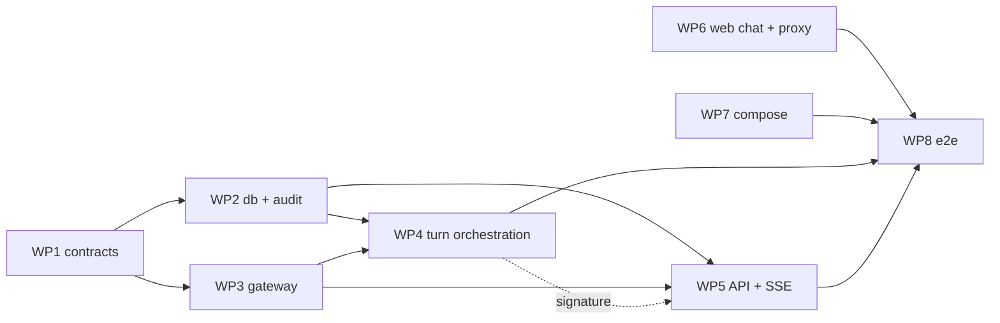

# PRD plan — M1: Walking skeleton

PRD: [`M1-walking-skeleton.md`](M1-walking-skeleton.md) (Approved). This plan says **how** M1 is built; requirements and acceptance criteria live in the PRD.

## Status

Draft — awaiting user review. Nothing is dispatched until the user approves this plan.

## Execution model

- Orchestrated with workmux (`.workmux.yaml`, `AGENTS.md` §49a "Orchestration with workmux"). The orchestrator dispatches one lane per work package (WP), up to 8 concurrent lanes, and merges serially.
- Lanes in the same wave never write the same file. Shared contracts below are fixed before dispatch and quoted verbatim into every lane prompt that uses them.
- Pre-merge checks (orchestrator): lane `HANDOFF` present, diff inside the lane's owned paths, the lane's acceptance command passes, `make test` and `make lint` pass.
- Tests may call the live model (`CHAT_MODEL`). Live tests are marked `@pytest.mark.live`; `make test` runs them only when `OPENROUTER_API_KEY` is set.

## Shared contracts (fixed before dispatch)

All Python lives in the `mana_leak_core` package (`packages/core/src/mana_leak_core/`) unless a WP says otherwise. Names and shapes follow `docs/contracts.md`; this table only fixes **module locations** so lanes can import each other.

| Contract | Module | Defined by | Source |
|---|---|---|---|
| `Route`, `MessageRole`, `Severity`, `AuditEventType` enums | `contracts/enums.py` | WP1 | contracts → Core enums, Audit events |
| `ErrorCode`, `ErrorInfo`, `ErrorResponse`, `ManaLeakError` | `contracts/errors.py` | WP1 | contracts → Error taxonomy, HTTP error mapping |
| `TurnEvent` union (`MessageStart`, `TextDelta`, `ToolStart`, `ToolEnd`, `Final`, `ErrorEvent`, `MessageEnd`); `TurnResult` placeholder (`None` only in M1) | `contracts/events.py` | WP1 | contracts → Streaming events |
| `ConversationSummary`, `ConversationDetail`, `MessageOut`, `HealthResponse` | `contracts/conversations.py` | WP1 | contracts → Core service interfaces, REST API |
| `Settings`, `get_settings()` (pydantic-settings, `env_ignore_empty=True`; M1 fields: `database_url`, `openrouter_api_key`, `chat_model`, `log_level`, limit defaults) | `settings.py` | WP1 | contracts → Configuration, Operational limits |
| `get_session()` async session factory; SQLModel tables `conversation`, `message`, `audit_event` | `db/` | WP2 | data-model → those tables |
| `emit_audit_event(event_type, severity, conversation_id=None, turn_id=None, details=None) -> None` (never raises) | `audit.py` | WP2 | contracts → Audit events |
| Model gateway: `async complete(messages, *, model, stream=False, max_tokens=1500, budget: TurnBudget) -> ModelResponse \| AsyncIterator[str]`; `TurnBudget(max_model_calls=8, deadline_s=120)`; reasoning disabled by default (`extra_body={"reasoning": {"enabled": False}}`); 30 s per-call timeout enforced with `asyncio.timeout`, not LiteLLM's `timeout` | `gateway.py` | WP3 | contracts → External adapters → Model gateway; ROADMAP → M1 spike results |
| Conversation service: `create_conversation`, `list_conversations`, `get_conversation`, `append_message`, `build_context` (last 10 turns, no summary in M1) | `conversations.py` | WP4 | contracts → Core service interfaces |
| `async def process_turn(conversation_id, user_message=None, forced_route=None, session_action=None) -> AsyncIterator[TurnEvent]`; M1 always routes `other` with a plain answer; per-conversation in-process lock raises `ManaLeakError(conflict)` | `orchestrator.py` | WP4 | contracts → Turn orchestration; PRD FR-5, FR-6 |
| SSE encoding: `event: <type>\ndata: <json>\n\n`, `: ping` every 15 s | `apps/api` | WP5 | contracts → SSE mapping |

Boundary files with a single owner: `packages/core/pyproject.toml`, `apps/api/pyproject.toml`, and `uv.lock` (WP1); `alembic.ini` and the migrations (WP2); `docker-compose.yml` and both Dockerfiles (WP7); `apps/web/**` (WP6).

## Work packages

| WP | Wave | Handle | Profile | Owns (paths) | Depends on | Acceptance command | PRD |
|---|---|---|---|---|---|---|---|
| WP1 | 1 | `m1-contracts` | `omp-worker-lite` | `packages/core/src/mana_leak_core/contracts/**`, `.../settings.py`, `packages/core/pyproject.toml` (+ `alembic`, `asyncpg`; Python deps), `apps/api/pyproject.toml`, `uv.lock`, `tests/core/test_contracts.py` | — | `uv run pytest tests/core/test_contracts.py` | NFR-1 (limits config), FR-2 (event shapes) |
| WP6 | 1 | `m1-web` | `omp-worker` | `apps/web/**` | — (codes against the SSE contract) | `npm --prefix apps/web run build && npm --prefix apps/web run lint` + its proxy test (below) | FR-1, FR-2 (UI), FR-3 (reload), FR-9, AC-10 (proxy half) |
| WP7 | 1 | `m1-compose` | `omp-worker-lite` | `docker-compose.yml`, `apps/api/Dockerfile`, `apps/web/Dockerfile`, `scripts/postgres-init/**`, `Makefile` | — | `docker compose config -q` (temp `.env`) | FR-8 (Compose half), AC-9 |
| WP2 | 2 | `m1-db` | `omp-worker` | `packages/core/src/mana_leak_core/db/**`, `.../audit.py`, `alembic.ini`, `packages/core/alembic/**`, `tests/core/test_db.py` | WP1 | `uv run pytest tests/core/test_db.py` (against Compose Postgres) | FR-3, FR-4, NFR-3, NFR-4 |
| WP3 | 2 | `m1-gateway` | `omp-worker` | `packages/core/src/mana_leak_core/gateway.py`, `tests/core/test_gateway.py` | WP1 | `uv run pytest tests/core/test_gateway.py` (includes one `live` streaming test) | NFR-1, NFR-2, FR-7 (model-call half), AC-6 |
| WP4 | 3 | `m1-turn` | `omp-worker-opus` | `.../conversations.py`, `.../orchestrator.py`, `tests/core/test_turn.py` | WP2, WP3 | `uv run pytest tests/core/test_turn.py` | FR-2, FR-3, FR-5, FR-6, FR-7, AC-1, AC-4, AC-5, AC-7 |
| WP5 | 3 | `m1-api` | `omp-worker` | `apps/api/src/mana_leak_api/**`, `tests/api/**` | WP2, WP3 (uses WP4's contract as written above) | `uv run pytest tests/api` | FR-1, FR-3, FR-6, FR-8, AC-2, AC-5, AC-8, AC-11, AC-10 (API half) |
| WP8 | 4 | `m1-e2e` | `omp-worker` | `tests/e2e/**`, `README.md` (quick start for M1) | WP4, WP5, WP6, WP7 | `make e2e` target added in this WP's own file `tests/e2e/run.sh` (Compose up → health → chat stream → restart → history → abort) | AC-3, AC-9, AC-10, AC-12 |

Notes:

- WP5 is cut in wave 3 alongside WP4 and imports `process_turn` by the fixed signature; its tests use a small fake generator until WP4 merges, then the orchestrator re-runs them against the real one before merging WP5 (WP4 merges first).
- WP6 builds the chat UI and the `/api/*` route handler against the SSE contract with a stub upstream in its own test. It needs no API code to exist. `next.config.ts` already has `compress: false`; the route handler also forces `Content-Encoding: identity` and forwards `request.signal`.
- WP7 adds the api health check (`/health`) and switches `web` to `depends_on: api: service_healthy` (it is `service_started` until `/health` exists, DOC-119). It also adds the api start command running `alembic upgrade head` before `uvicorn`.
- WP8 is the only lane that runs the full stack. It doesn't change product code; if an e2e check fails, the orchestrator opens a fix lane against the owning WP's paths.

## Waves

| Wave | Lanes | Merge order |
|---|---|---|
| 1 | WP1, WP6, WP7 | WP1, WP7, WP6 |
| 2 | WP2, WP3 | WP2, WP3 |
| 3 | WP4, WP5 | WP4, then WP5 (re-test against the real `process_turn`) |
| 4 | WP8 | WP8 |

Peak concurrency is 3, well under the limit of 8; M1's dependency chain doesn't allow more without file overlap.

## Verification at completion

M1 is `Complete` only when the PRD's completion condition holds:

1. Every AC-1…AC-12 is satisfied, by the WP tests above plus WP8's e2e run.
2. The demonstrable increment (AC-12) is performed manually in a browser by the orchestrator: create a conversation, stream several answers, reload, continue.
3. The `AGENTS.md` §49a review gate (milestone → Complete) passes.
4. `docs/ROADMAP.md` M1 status is set to `Complete`, and this plan's progress table is updated.

## Progress

| WP | Status | Merged commit | Notes |
|---|---|---|---|
| WP1 | Not started | | |
| WP2 | Not started | | |
| WP3 | Not started | | |
| WP4 | Not started | | |
| WP5 | Not started | | |
| WP6 | Not started | | |
| WP7 | Not started | | |
| WP8 | Not started | | |
