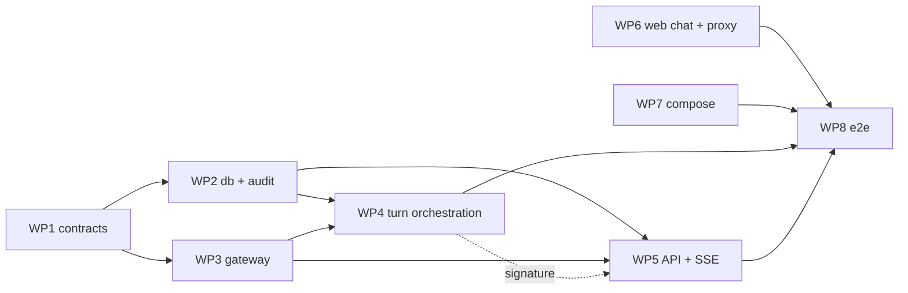

# PRD plan — M1: Walking skeleton

PRD: [`M1-walking-skeleton.md`](M1-walking-skeleton.md) (Approved). This plan says **how** M1 is built; requirements and acceptance criteria live in the PRD.

## Status

Approved (user, 2026-10-01). Wave 1 dispatched.

Review log: Fable single pass 2026-10-01 — 8 MAJOR / 6 MINOR / 2 NIT; all applied.

## Execution model

- Orchestrated with workmux (`.workmux.yaml`, `AGENTS.md` §49a "Orchestration with workmux"). The orchestrator dispatches one lane per work package (WP), up to 8 concurrent lanes, and merges serially.
- Lanes in the same wave never write the same file. Shared contracts below are fixed before dispatch and quoted verbatim into every lane prompt that uses them.
- Pre-merge checks (orchestrator): lane `HANDOFF` present, diff inside the lane's owned paths, the lane's acceptance command passes, `make test` and `make lint` pass.
- Tests may call the live model (`CHAT_MODEL`). Live tests are marked `@pytest.mark.live` (registered in root `pyproject.toml`, WP1); `make test` runs `uv run pytest -m 'not live'` unless `OPENROUTER_API_KEY` is already set in the shell environment, in which case it runs the full suite including live tests — the Makefile exports `OPENROUTER_API_KEY` from `.env` first if it's present there but not already in the environment (WP7).
- From wave 2 on, the orchestrator keeps `docker compose up postgres` running for every pre-merge `make test` run; DB-backed lanes test against a dedicated `mana_leak_test` database (WP7's init script), never the `mana_leak` database used for the manual AC-12 demo.

## Shared contracts (fixed before dispatch)

All Python lives in the `mana_leak_core` package (`packages/core/src/mana_leak_core/`) unless a WP says otherwise. Names and shapes follow `docs/contracts.md`; this table only fixes **module locations** so lanes can import each other.

| Contract | Module | Defined by | Source |
|---|---|---|---|
| `Route`, `MessageRole`, `Severity`, `AuditEventType` enums | `contracts/enums.py` | WP1 | contracts → Core enums, Audit events |
| `ErrorCode`, `ErrorInfo`, `ErrorResponse`, `ManaLeakError` | `contracts/errors.py` | WP1 | contracts → Error taxonomy, HTTP error mapping |
| `TurnEvent` union (`MessageStart`, `TextDelta`, `ToolStart`, `ToolEnd`, `Final`, `ErrorEvent`, `MessageEnd`); `TurnResult` placeholder (`None` only in M1) | `contracts/events.py` | WP1 | contracts → Streaming events |
| `ConversationSummary`, `ConversationDetail`, `MessageOut`, `HealthResponse` | `contracts/conversations.py` | WP1 | contracts → Core service interfaces, REST API |
| `Settings`, `get_settings()` (pydantic-settings, `SettingsConfigDict(env_file='.env', env_ignore_empty=True, extra='ignore')`; M1 fields: `database_url`, `openrouter_api_key`, `chat_model`, `log_level`, limit defaults) | `settings.py` | WP1 | contracts → Configuration, Operational limits |
| `get_session()` async session factory on `create_async_engine(settings.database_url, pool_pre_ping=True)` — psycopg 3's async dialect (`postgresql+psycopg://…`), no `asyncpg`; the `DATABASE_URL` scheme is unchanged everywhere; SQLModel tables `conversation`, `message`, `audit_event` | `db/` | WP2 | data-model → those tables |
| `emit_audit_event(event_type, severity, conversation_id=None, turn_id=None, details=None) -> None` (never raises) | `audit.py` | WP2 | contracts → Audit events |
| Model gateway: `async def complete(messages, *, model, tools=None, response_model=None, stream=False, max_tokens=1500, trace: TraceContext \| None = None) -> ModelResponse \| AsyncIterator[ModelChunk]` — contracts.md's signature verbatim, with M1-unused `tools`/`response_model`/`trace` defaulted (Langfuse tracing is out of M1 scope, so WP3 never builds a `TraceContext`); `process_turn` sets a per-turn call-budget contextvar (`max_model_calls=8` absolute cap) at turn start, and `complete()` reads and increments it from that contextvar on every call (not a `budget` parameter), raising `model_limit_exceeded` and emitting `limit_reached` itself when the next call would exceed the cap or a single call exceeds its 30 s timeout; the orchestrator separately owns and emits `limit_reached` for the 120 s overall turn deadline (exactly one emitter per limit); reasoning disabled by default (`extra_body={"reasoning": {"enabled": False}}`); 30 s per-call timeout enforced with `asyncio.timeout`, not LiteLLM's `timeout` | `gateway.py` | WP3 | contracts → External adapters → Model gateway, Langfuse, Operational limits (counting rule); ROADMAP → M1 spike results |
| Conversation service: `create_conversation`, `list_conversations`, `get_conversation`, `append_message`, `build_context` (last 10 turns, no summary in M1) | `conversations.py` | WP4 | contracts → Core service interfaces |
| `async def process_turn(conversation_id, user_message=None, forced_route=None, session_action=None) -> AsyncIterator[TurnEvent]`; M1 always routes `other` with a plain answer; a per-conversation in-process lock raises `ManaLeakError(conflict)` on the generator's first `__anext__()`, before anything is emitted, and is released in a `finally` so `aclose()`/cancellation always frees it (one abort never wedges the conversation); on cancellation — client disconnect or the 120 s turn deadline — partial assistant text is persisted under `asyncio.shield` with `payload.error = {"code": "timeout", "message": "client disconnected"}` (disconnect) or the turn-timeout equivalent, and the orchestrator itself emits `limit_reached` for the turn deadline | `orchestrator.py` | WP4 | contracts → Turn orchestration; PRD FR-5, FR-6, FR-9, AC-7, AC-10 |
| SSE encoding: `event: <type>\ndata: <json>\n\n`, `: ping` every 15 s; the API `await`s `process_turn`'s first event before constructing the `200` streaming response, so a `conflict` raised there maps to `409` via the standard HTTP error mapping — never an in-stream `error` event | `apps/api` | WP5 | contracts → SSE mapping, HTTP error mapping |

Boundary files with a single owner: `packages/core/pyproject.toml`, `apps/api/pyproject.toml`, root `pyproject.toml`, `uv.lock`, and `tests/conftest.py` (WP1); `packages/core/alembic.ini` and the migrations (WP2); `docker-compose.yml`, both Dockerfiles, and `apps/web/.dockerignore` (WP7); `apps/web/**` excluding `apps/web/Dockerfile` and `apps/web/.dockerignore` (WP6).

## Work packages

| WP | Wave | Handle | Profile | Owns (paths) | Depends on | Acceptance command | PRD |
|---|---|---|---|---|---|---|---|
| WP1 | 1 | `m1-contracts` | `omp-worker-lite` | `packages/core/src/mana_leak_core/contracts/**`, `.../settings.py`, `packages/core/pyproject.toml` (+ `alembic`; Python deps — `psycopg[binary]` already present, no `asyncpg`), `apps/api/pyproject.toml`, root `pyproject.toml` (pytest config: register the `live` marker, pick the anyio async-test runner), `uv.lock`, `tests/core/test_contracts.py`, `tests/conftest.py` (anyio backend fixture; `db` fixture against `mana_leak_test`, migrates once per session and truncates per test) | — | `uv run pytest tests/core/test_contracts.py` | NFR-1 (limits config), FR-2 (event shapes) |
| WP6 | 1 | `m1-web` | `omp-worker` | `apps/web/**` excluding `apps/web/Dockerfile` and `apps/web/.dockerignore` (WP7) | — (codes against the SSE contract) | `npm --prefix apps/web run build && npm --prefix apps/web run lint && npm --prefix apps/web run test:proxy` (vitest, `src/app/api/__tests__/proxy.test.ts`, against a stub upstream; asserts (1) `Content-Encoding: identity` on the proxied response, (2) SSE chunks forwarded byte-for-byte with no buffering/re-encoding, and (3) aborting the client request propagates to the stub via `request.signal`) | FR-1, FR-2 (UI), FR-3 (reload), FR-9, AC-10 (proxy half) |
| WP7 | 1 | `m1-compose` | `omp-worker-lite` | `docker-compose.yml`, `apps/api/Dockerfile`, `apps/web/Dockerfile`, `apps/web/.dockerignore`, `scripts/postgres-init/**`, `Makefile` | — | `docker compose config -q` | FR-8 (Compose half), AC-9 |
| WP2 | 2 | `m1-db` | `omp-worker` | `packages/core/src/mana_leak_core/db/**`, `.../audit.py`, `packages/core/alembic.ini`, `packages/core/alembic/**`, `tests/core/test_db.py` | WP1 | `uv run pytest tests/core/test_db.py` (against Compose Postgres, `mana_leak_test` database) | FR-3, FR-4, NFR-3, NFR-4 |
| WP3 | 2 | `m1-gateway` | `omp-worker` | `packages/core/src/mana_leak_core/gateway.py`, `tests/core/test_gateway.py` | WP1 | `uv run pytest tests/core/test_gateway.py` (includes one `live` streaming test) | NFR-1, NFR-2, FR-7 (model-call half), AC-6 |
| WP4 | 3 | `m1-turn` | `omp-worker-opus` | `.../conversations.py`, `.../orchestrator.py`, `tests/core/test_turn.py` | WP2, WP3 | `uv run pytest tests/core/test_turn.py` | FR-2, FR-3, FR-5, FR-6, FR-7, FR-9 (server half), AC-1, AC-4, AC-5, AC-7, AC-10 (server half) |
| WP5 | 3 | `m1-api` | `omp-worker` | `apps/api/src/mana_leak_api/**`, `tests/api/**` | WP2, WP3 (uses WP4's contract as written above) | `uv run pytest tests/api` | FR-1, FR-3, FR-6, FR-8, AC-2, AC-5, AC-8, AC-11, AC-10 (API half) |
| WP8 | 4 | `m1-e2e` | `omp-worker` | `tests/e2e/**`, `README.md` (quick start for M1) | WP4, WP5, WP6, WP7 | `make e2e` (WP7's Makefile target runs `tests/e2e/run.sh`: Compose up → wait on `docker compose ps --format json` health for `postgres`/`api`/`web` → chat stream → restart `postgres` and `api` → history → abort) | AC-3, AC-9, AC-10, AC-12 |

Notes:

- WP3 is cut in wave 2 alongside WP2 and codes against the fixed `emit_audit_event` signature (Shared contracts), patching it in its own tests since WP2's `audit.py` doesn't exist yet in the same wave; the orchestrator re-runs WP3's suite against the real `audit.py` once WP2 merges (merge order is already WP2, then WP3).
- WP5 is cut in wave 3 alongside WP4 and imports `process_turn` by the fixed signature; its tests use a small fake generator until WP4 merges, then the orchestrator re-runs them against the real one before merging WP5 (WP4 merges first), adding a real two-concurrent-POST test (second request while the first is still streaming) at that point — the fake generator can't exercise the in-process conflict lock at all.
- WP6 builds the chat UI and the `/api/*` route handler against the SSE contract with a stub upstream in its own test. It needs no API code to exist. `next.config.ts` already has `compress: false`; the route handler also forces `Content-Encoding: identity` and forwards `request.signal`.
- WP7 adds the api health check via `python -c`/`urllib` against `http://127.0.0.1:8000/health` (the slim base image has no `curl`) and a web health check via busybox `wget -qO- http://127.0.0.1:3000/`, and switches both `web` and `api` to `depends_on: ... condition: service_healthy` (each is `service_started` until its health check exists, DOC-119). It adds the api start command `alembic -c packages/core/alembic.ini upgrade head && uvicorn mana_leak_api.main:app --host 0.0.0.0 --port 8000` — a single worker, so the per-conversation in-process lock stays effective (AC-5); `env.py` reads `Settings().database_url`. It adds `mana_leak_test` to `scripts/postgres-init/01-databases.sh`, adds `e2e: ; tests/e2e/run.sh` to the `Makefile`, and gates `make test`'s live-model tests on `OPENROUTER_API_KEY` (Execution model, above).
- WP8 is the only lane that runs the full stack. It doesn't change product code; if an e2e check fails, the orchestrator opens a fix lane against the owning WP's paths.

## Per-WP checklists

Easily-missed items per WP, synthesised from the PRD and `docs/contracts.md`/`docs/data-model.md` (not a restatement of the acceptance command above):

**WP1 — contracts, settings, test infra**
- `ErrorCode`/`ErrorResponse` cover only M1's reachable codes (`validation_error`, `not_found`, `conflict`, `dependency_unavailable`, `timeout`, `internal_error`, PRD §6) — don't stub later-milestone codes as if they're used.
- `Settings` needs `extra='ignore'`; test it by loading a `.env` that also carries an unrelated key (e.g. `LANGFUSE_PUBLIC_KEY`).
- Register the `live` marker in root `pyproject.toml` so `-m 'not live'` doesn't warn on an unknown marker.
- `tests/conftest.py`'s `db` fixture targets `mana_leak_test`, not the Compose default `mana_leak` database.
- `HealthResponse.langfuse` is always `"disabled"` in M1 (no Langfuse integration yet) — not a boolean, and not omitted.
- `Final.error`/`ErrorEvent.error` both carry the same `ErrorInfo` shape as REST errors — don't define a narrower one for SSE.

**WP2 — db + audit**
- `conversation.title` is set from the first user message (data-model.md), not left null.
- `conversation.updated_at` bumps on every new message — `GET /conversations` orders by it, descending.
- `audit_event.severity` CHECK constraint (`info`/`warning`/`error`) belongs in the migration, not just the Pydantic model.
- `get_session()` uses `create_async_engine(..., pool_pre_ping=True)` — a bare engine survives a restart only until the first stale connection is used.
- `alembic/env.py` reads `Settings().database_url` rather than hardcoding a URL.
- `emit_audit_event` logs and swallows a failed write; it never raises into the caller.
- Unique `(conversation_id, seq)` on `message` drives ordered history — don't rely on an autoincrement PK alone.

**WP3 — gateway**
- Reasoning disabled by default on every call (`extra_body={"reasoning": {"enabled": False}}`, NFR-2) — not opt-in per call.
- The 30 s per-call timeout is the gateway's own `asyncio.timeout`/`wait_for`, independent of LiteLLM's `timeout=` kwarg (NFR-1; the M1 spike showed the latter alone doesn't cancel a hung call).
- M1 callers pass `tools=None`, `response_model=None`, `trace=None` — read the per-turn call-budget contextvar `process_turn` sets, don't add a `budget` parameter.
- Raises `model_limit_exceeded` and emits `limit_reached` itself at the 8-call absolute cap.
- Redaction check (no configured secret value in an outbound message) runs even with tracing disabled.
- Tests patch `emit_audit_event` until WP2 merges, then get re-run against the real one (Notes, above).

**WP4 — turn orchestration**
- Deterministic validation (step 1) still runs in M1 (empty/malformed/`>8,000`-char message, bad `action` value → `validation_error`, nothing persisted) — model screening is M8; every valid message is treated as `clear`.
- The `action` body field is parsed and accepted in M1 even though no Judge session can ever be active yet — it's a no-op, not rejected as unknown.
- Context build is last-10-turns only; no summarisation attempt (`conversation.summary` stays empty).
- The conflict lock is acquired/released for the generator's whole lifetime (`finally`, covering `aclose()`), and raises before the first event is emitted.
- Cancellation (disconnect or turn-deadline) persists partial text under `asyncio.shield` with `payload.error` set — same path, different `error` content for AC-7 vs. AC-10.
- `other`-route `TurnResult` is `None` (not `{}` or an omitted field).

**WP5 — API + SSE**
- Replace FastAPI's default 422 handler so body-validation failures emit `ErrorResponse{error.code="validation_error"}` (contracts.md:795), not FastAPI's default shape.
- `GET /conversations?limit=50` default, ordered by `updated_at` descending.
- `: ping` every 15 s while waiting on the model — easy to skip since M1's `other` answers are fast in dev.
- Await `process_turn`'s first event before building the streaming response, so `conflict` maps to `409`, never an in-stream `error`.
- `GET /conversations/{id}` for an unknown ID is `404 not_found` (AC-11) — test it explicitly.
- Add the real two-concurrent-POST test once WP4 merges (Notes, above), replacing the fake-generator version.

**WP6 — web**
- The route handler forwards method/headers/body unchanged, stripping only the `/api` prefix — no re-serialization, or SSE framing breaks.
- `Content-Encoding: identity` is forced on the proxied response in addition to `next.config.ts`'s `compress:false` — the two are independent layers.
- `request.signal` is forwarded to the upstream `fetch` so a tab close/stop propagates as a real abort.
- Render ascending-`seq` message order from `GET /conversations/{id}`, matching persistence.
- No domain rendering (cards/combos/rulings) exists yet — only plain text and a loading/streaming state.
- Needs no API code to exist (stub upstream in its own test) — doesn't block on WP5.

**WP7 — compose**
- Exact start command: `alembic -c packages/core/alembic.ini upgrade head && uvicorn mana_leak_api.main:app --host 0.0.0.0 --port 8000`, single worker.
- api healthcheck via `python -c`/`urllib` (no `curl` in the slim image); web healthcheck via busybox `wget -qO-`.
- `mana_leak_test` added to `scripts/postgres-init/01-databases.sh` alongside `mana_leak`/`langfuse`.
- `Makefile` adds `e2e: ; tests/e2e/run.sh` and the live-test gate (Execution model, above).
- `web`'s `depends_on: api: condition: service_healthy`, not `service_started`.
- No temp `.env` needed for `docker compose config -q` — `.env` is already symlinked into every worktree.

**WP8 — e2e**
- Wait on Compose health (`docker compose ps --format json`) for all three services before the chat-stream step, not a fixed sleep.
- Restart both `postgres` and `api` (PRD AC-3) — restarting only one doesn't exercise `pool_pre_ping`.
- The abort step closes the SSE connection mid-stream, then asserts the partial text persisted with `payload.error` via `GET /conversations/{id}` — not just that the stream terminates.
- Doesn't change product code; a failing check opens a fix lane against the owning WP's paths.
- `README.md`'s quick start matches the actual `make e2e`/`docker compose up` commands WP7 adds, not placeholders.

## Waves

| Wave | Lanes | Merge order |
|---|---|---|
| 1 | WP1, WP6, WP7 | WP1, WP7, WP6 |
| 2 | WP2, WP3 | WP2, WP3 |
| 3 | WP4, WP5 | WP4, then WP5 (re-test against the real `process_turn`) |
| 4 | WP8 | WP8 |

Peak concurrency is 3, well under the limit of 8; M1's dependency chain doesn't allow more without file overlap.

## Verification at completion

M1 is `Complete` only when the PRD's completion condition holds:

1. Every AC-1…AC-12 is satisfied, by the WP tests above plus WP8's e2e run.
2. The demonstrable increment (AC-12) is performed manually in a browser by the orchestrator: create a conversation, stream several answers, reload, continue.
3. The `AGENTS.md` §49a review gate (milestone → Complete) passes.
4. `docs/ROADMAP.md` M1 status is set to `Complete`, and this plan's progress table is updated.

## Progress

| WP | Status | Merged commit | Notes |
|---|---|---|---|
| WP1 | Not started | | |
| WP2 | Not started | | |
| WP3 | Not started | | |
| WP4 | Not started | | |
| WP5 | Not started | | |
| WP6 | Not started | | |
| WP7 | Not started | | |
| WP8 | Not started | | |
