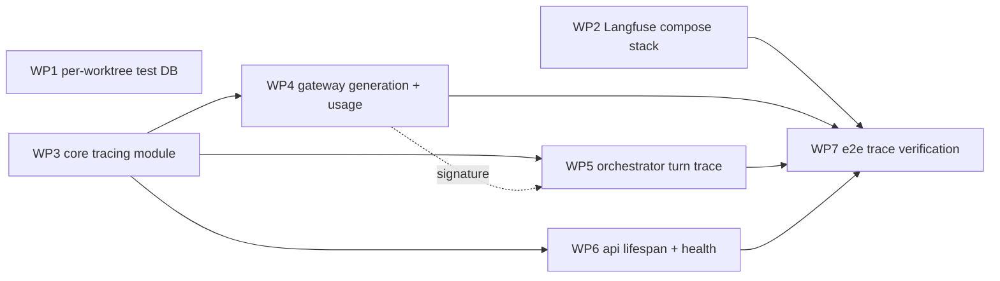

# PRD plan — M2: Observability

PRD: [`M2-observability.md`](M2-observability.md) (Approved). This plan says **how** M2 is built; requirements and acceptance criteria live in the PRD.

## Status

Draft — awaiting user review. Nothing is dispatched until the user approves this plan.

## Execution model

- Orchestrated with workmux (`.workmux.yaml`, `AGENTS.md` §49a "Orchestration with workmux"). The orchestrator dispatches one lane per work package (WP), up to 8 concurrent lanes (peak here is 3), and merges serially.
- Lanes in the same wave never write the same file. Shared contracts below are fixed before dispatch and quoted verbatim into every lane prompt that uses them.
- Pre-merge checks (orchestrator): lane `HANDOFF` present, diff inside the lane's owned paths, the lane's acceptance command passes, `make test` and `make lint` pass.
- **Prerequisite before dispatching wave 1 (WP1's per-worktree database design):** the `mana_leak` Postgres role must have the `CREATEDB` attribute on the Postgres container/volume already running for pre-merge tests, which it does not have today (`scripts/postgres-init/01-databases.sh` only ever ran `CREATE USER mana_leak WITH PASSWORD ...`, no `CREATEDB`). That init script only runs once, at first volume init, so WP1's own edit to it (adding `CREATEDB`) cannot retroactively grant the attribute to an already-initialized volume — it only benefits a future fresh clone/volume (including this plan's own completion-time fresh-volume check, below). Before dispatching wave 1, the orchestrator runs a one-time `docker exec <postgres-container> psql -U postgres -c "ALTER ROLE mana_leak CREATEDB"` against the currently-running volume. Skipping this makes WP1's own acceptance test, and every later wave's DB-backed pre-merge tests, silently *skip* (the `db` fixture already treats a provisioning failure like an unreachable database) instead of fail — easy to miss.
- Postgres must already be up for pre-merge tests from **wave 1** on, not wave 2 as in M1 — WP1 itself is DB-fixture work, unlike M1's DB-free wave 1. The orchestrator keeps `docker compose up postgres` running for every pre-merge `make test` run starting with wave 1. **The Langfuse stack (WP2's services) is not required for any wave's pre-merge `make test`** — WP3/WP4/WP5/WP6's tests use fakes, an in-memory OTel span exporter, or a deliberately unreachable/hung local host, never a real Langfuse server. Only WP7's `make e2e` and the final completion verification need the real stack up.
- **No lane wraps a Langfuse SDK call in `asyncio.timeout`/`asyncio.wait_for`, and no lane opens or holds a Langfuse span across an `asyncio.create_task()` boundary.** `tracing.py` (WP3) owns all bounding and no-op degradation internally (Shared contracts, below) — callers (WP4, WP5) trust that guarantee instead of re-implementing it, exactly mirroring the M1 lesson that the gateway's own per-call timeout and call-budget contextvar only work because the whole turn runs on one `asyncio` task (`apps/api/src/mana_leak_api/sse.py`'s single producer task).
- `start_as_current_observation`/`propagate_attributes` are **synchronous-only** context managers in the installed `langfuse==4.16.0` (verified below: `async with` raises `TypeError`, no `__aenter__`). Every lane uses plain `with`, never `async with`, including inside `async def` generators — verified safe (below) because a contextvar set inside an async generator's body is visible across its own `yield` points as long as one `asyncio` task drives it start to finish, which the existing SSE architecture already guarantees.
- Tests may call the live model (`CHAT_MODEL`) per the M1 convention (`make test` runs `-m 'not live'` unless `OPENROUTER_API_KEY` is already set); M2 adds no new live-model test needs. M2's new span/trace assertions use a local `InMemorySpanExporter` (ships with `opentelemetry-sdk`, already an installed transitive dependency of `langfuse` — verified below, no new dependency) and never touch the network.
- Unlike M1, **no WP touches `pyproject.toml`, `uv.lock`, or `Makefile`.** `langfuse>=4.7,<5` is already pinned (PRD §9 Constraints) and resolves to `langfuse==4.16.0` in `uv.lock` today; no new Python dependency is needed. No new `make` target is needed either — `make test`, `make lint`, `make e2e`, and `make docker-up` already cover everything M2 adds once WP2's Compose services and WP7's e2e script exist.

## Shared contracts (fixed before dispatch)

All Python lives in `mana_leak_core`/`mana_leak_api` per the existing M1 layout unless noted. Names and shapes follow `docs/contracts.md`; this table (plus the code block beneath it) fixes **module locations and exact signatures** so WP4–WP6 can code against WP3's module in parallel without guessing.

| Contract | Module | Defined by | Source |
|---|---|---|---|
| `TraceContext`, `Observation`, `start_turn_trace`, `record_generation`, `refresh_health`, `current_health`, `health_refresh_loop`, `shutdown` (full signatures below) | `tracing.py` (**new**) | WP3 | contracts.md → External adapters → Langfuse |
| `Settings.langfuse_public_key: str \| None = None`, `langfuse_secret_key: SecretStr \| None = None`, `langfuse_host: str = "http://localhost:3001"` | `settings.py` | WP3 | contracts.md → Configuration |
| Model gateway `complete()`'s `trace` parameter becomes `trace: TraceContext \| None = None` (real type; same keyword, same default, same position — M1's `trace: object \| None` placeholder is replaced, the public signature does not otherwise change) | `gateway.py` | WP4 | contracts.md → Model gateway |
| Per-worktree test database `mana_leak_test_<slug>`, where `<slug>` is the current worktree's own checkout-directory name (workmux's lane handle), lowercased with every run of non-`[a-z0-9]` characters collapsed to one `_`; created on first use via a new `CREATEDB` grant on the `mana_leak` role, dropped at session end; same schema/migrations as today's shared `mana_leak_test` | `tests/conftest.py`, `scripts/postgres-init/01-databases.sh` | WP1 | `docs/ROADMAP.md`:654 (user decision); PRD §9 Constraints |
| Compose Langfuse-stack service names `langfuse-web` (host port **3001** only), `langfuse-worker`, `clickhouse`, `redis`, `minio` — all on the **existing** `postgres` service's `langfuse` database/user (no second Postgres); `api`/`web` carry **no** `depends_on` on any of them | `docker-compose.yml` | WP2 | PRD §10 Risks (verified image tags/ports); architecture.md → Container architecture, Local deployment |

**`tracing.py`'s public API (WP3), verified against the installed `langfuse==4.16.0` — WP4/WP5/WP6 import and call exactly this, nothing more:**

```python
from contextlib import AbstractContextManager
from typing import Any, Literal, Protocol
from uuid import UUID

from mana_leak_core.contracts.enums import Route

class TraceContext:                       # @dataclass(frozen=True); contracts.md verbatim
    conversation_id: UUID
    turn_id: UUID
    route: Route
    prompt_version: str | None = None     # always None at M2 (no prompt-versioning scheme yet)

class Observation(Protocol):
    def update(self, **kwargs: Any) -> None: ...   # real LangfuseSpan/-Generation, or a no-op stand-in

def start_turn_trace(trace: TraceContext, *, input: str | None = None) -> AbstractContextManager[Observation]: ...
def record_generation(trace: TraceContext | None, *, model: str, input: Any = None) -> AbstractContextManager[Observation]: ...

async def refresh_health() -> None: ...                          # one attempt now; never raises
def current_health() -> Literal["ok", "disabled", "unavailable"]: ...   # last-cached state, sync, no I/O
async def health_refresh_loop(interval_s: float = 30.0) -> None: ...    # refresh, sleep, repeat; cancel to stop
async def shutdown(timeout_s: float = 10.0) -> None: ...                # flush + shutdown, bounded, never raises
```

Guarantees WP4/WP5/WP6 may rely on without their own try/except:

- **Never raises, never blocks the caller past a bounded amount.** `start_turn_trace`/`record_generation` catch every exception from opening or closing the underlying Langfuse span (construction, `__enter__`, `__exit__`) and yield a no-op `Observation` (whose `.update(**kwargs)` does nothing) instead. They never attempt a network call at all — span creation in this OTel-based SDK is a local, in-memory operation (verified below: pointing a client at an address that accepts-but-never-responds, span open/update/close still completes in well under a second) — so **a hung Langfuse cannot add latency to a turn**, independent of any timeout. Exceptions raised by the *caller's own code* inside the `with` block (e.g. a real turn error) propagate through normally — the wrapper only swallows failures in its own SDK calls.
- **No-op when disabled.** If `langfuse_public_key` or `langfuse_secret_key` is unset, the module never constructs a client and never attempts any outbound call (AC-6).
- **Secret-safe by construction.** Every string value in `input`/`output`/`metadata` — recursing through lists/dicts, so the gateway's `messages` list is covered the same way a plain string is — is scrubbed for any configured `SecretStr` value before it reaches the real SDK call, on *both* `start_turn_trace` and `record_generation` and on every `.update()` call the yielded `Observation` makes afterward (NFR-2, AC-8). `usage_details`/`cost_details`/`model` pass through unscrubbed (always provider-reported numbers/IDs, never free-form content). This is new logic that lives only here — `gateway.py`'s existing `_check_no_secrets` (the outbound-model-call guard) is **not modified**; it already covers `langfuse_secret_key` automatically because it iterates `Settings`' `SecretStr` fields generically (confirmed by its own module docstring), and because it *raises* (correctly, to block an outbound model call) it is the wrong behaviour to reuse for scrubbing trace/generation text, where a coincidental match must not fail the turn.
- **IDs, verified against `langfuse==4.16.0`:** `start_turn_trace` opens the span with `trace_context={"trace_id": trace.turn_id.hex}` — a UUID's raw 32-lowercase-hex-character form is already a valid OTel trace ID, so the Langfuse trace ID is *bit-identical* to `turn_id` (round-trips exactly via `uuid.UUID(hex=trace_id) == turn_id`; verified empirically), not merely derived from it — and `name=str(trace.turn_id)` plus `propagate_attributes(session_id=str(trace.conversation_id), trace_name=str(trace.turn_id))` so the trace name is also `turn_id` and the session is `conversation_id` (FR-4, NFR-3). `metadata={"route": trace.route.value, "prompt_version": trace.prompt_version}` is set automatically from `trace`; callers do not pass metadata separately.
- **Child linkage is ambient, not threaded.** `record_generation` calls the *module-level* cached client's `start_as_current_observation(as_type="generation", ...)` (not a method on a held span object) and relies entirely on OTel's contextvar-based "currently active span" to nest correctly — verified empirically: calling it on the top-level client while a turn span is active via `with start_turn_trace(...)` produces a child of that exact trace, with no span handle passed between `orchestrator.py` and `gateway.py`. This only works because both run in the same task (Execution model, above); `trace=None` (no ambient turn, e.g. a future non-turn caller) is always a no-op.
- **Health state.** `refresh_health()` calls the client's `auth_check()` off the event loop (`asyncio.to_thread` — `auth_check`/`flush`/`shutdown` are all synchronous/blocking in this SDK, verified) and maps success → `"ok"`, any exception (unreachable, wrong/mismatched keys — `auth_check` re-raises on auth failure rather than returning a value) → `"unavailable"`, no client configured → `"disabled"`, writing the result to a module-level variable `current_health()` reads back synchronously. The SDK's own request timeout defaults to 5 s (verified in the constructor docstring), which already bounds `auth_check` against a hung host (AC-12) without any extra `asyncio.timeout`.
- **Client construction reads only `Settings`.** The memoized client (mirrors `get_settings()`'s own `@lru_cache` pattern, including the test-isolation convention: `get_settings.cache_clear()` is paired with this module's own cache-clear in any test that changes Langfuse env vars) is built with `Langfuse(public_key=settings.langfuse_public_key, secret_key=settings.langfuse_secret_key.get_secret_value(), base_url=settings.langfuse_host)` — always passing `base_url` explicitly (verified: the SDK's `host` constructor kwarg is **deprecated** in favour of `base_url`; both default to `https://cloud.langfuse.com` if omitted) so the SDK's own environment lookup and Cloud default are never reached (FR-3, AC-11).

## Work packages

| WP | Wave | Handle | Profile | Owns (paths) | Depends on | Acceptance command | PRD |
|---|---|---|---|---|---|---|---|
| WP1 | 1 | `m2-test-db` | `omp-worker-lite` | `tests/conftest.py`, `scripts/postgres-init/01-databases.sh`, `tests/core/test_db.py` | — | `uv run pytest tests/core/test_db.py` | — (dev tooling; PRD §9 Constraints, `docs/ROADMAP.md`:654) |
| WP2 | 1 | `m2-compose` | `omp-worker` | `docker-compose.yml`, `.env.example` | — | `docker compose config -q` | FR-1, FR-2, FR-8, AC-1, AC-2 |
| WP3 | 1 | `m2-tracing-core` | `omp-worker-opus` | `packages/core/src/mana_leak_core/tracing.py` (new), `.../settings.py`, `tests/core/test_tracing.py` (new) | — | `uv run pytest tests/core/test_tracing.py` | FR-3, FR-6, FR-7 (refresher), NFR-1, NFR-2 (mechanism), AC-6, AC-7 (mechanism), AC-8 (mechanism), AC-10 (mechanism), AC-11, AC-12 (mechanism) |
| WP4 | 2 | `m2-gateway-trace` | `omp-worker-opus` | `packages/core/src/mana_leak_core/gateway.py`, `tests/core/test_gateway.py` | WP3 | `uv run pytest tests/core/test_gateway.py` | FR-4 (generation half), FR-5, NFR-2 (generation input half), AC-4 (generation half) |
| WP5 | 2 | `m2-orchestrator-trace` | `omp-worker-opus` | `packages/core/src/mana_leak_core/orchestrator.py`, `tests/core/test_turn.py` | WP3 (codes against WP4's fixed `complete(trace=...)` contract, re-tested once WP4 merges) | `uv run pytest tests/core/test_turn.py` | FR-4 (trace half), FR-6, NFR-1, NFR-2 (trace input half), NFR-3, AC-3 (code half), AC-4 (trace half), AC-5, AC-8, AC-10 (turn half), AC-12 (turn half) |
| WP6 | 2 | `m2-api-health` | `omp-worker` | `apps/api/src/mana_leak_api/main.py`, `.../routers/health.py`, `tests/api/test_health.py` | WP3 | `uv run pytest tests/api/test_health.py` | FR-7 (endpoint + lifespan), AC-7, AC-10 (health half) |
| WP7 | 3 | `m2-e2e` | `omp-worker` | `tests/e2e/run.py`, `tests/e2e/run.sh`, `README.md` | WP2, WP4, WP5, WP6 | `make e2e` | FR-1, FR-2, FR-8 (operational re-proof), AC-1, AC-2, AC-3 (query half), AC-5 (e2e reinforcement), AC-9 |

Notes:

- WP4 and WP5 are cut in the same wave (2), each coding only against WP3's fixed `tracing.py` contract (merged from wave 1) — never against each other's in-flight code. WP5's AC-4 parent/child-span test initially patches `mana_leak_core.gateway.complete` in its own worktree (WP4's real generation span does not exist there yet); the orchestrator re-runs WP5's suite against the real, merged `gateway.py` once WP4 merges (merge order: WP4, then WP5), adding the real cross-module parent-span assertion the patched version cannot exercise — this is the exact WP4/WP5 pattern M1's plan used for `process_turn`/the API layer.
- WP6 has no signature dependency on WP4 or WP5 (different files: `main.py`/`health.py` vs. `gateway.py`/`orchestrator.py`) and can merge at any point in wave 2.
- WP2's `docker-compose.yml`/`.env.example` work is independent of all Python changes; its acceptance command (`docker compose config -q`) only validates structure, mirroring M1's WP7 — full-stack boot health is proved once, by WP7's e2e run, not per-lane.
- WP2's lane must also fill the new Langfuse-stack secrets (`LANGFUSE_INIT_*`, `NEXTAUTH_SECRET`, `SALT`, `ENCRYPTION_KEY`, `CLICKHOUSE_PASSWORD`, `REDIS_AUTH`, `MINIO_ROOT_PASSWORD`, and matching `LANGFUSE_PUBLIC_KEY`/`LANGFUSE_SECRET_KEY`) into the **shared, symlinked** `.env` itself (not just document them in `.env.example`), exactly as M1's WP7 lane filled in the Postgres passwords — otherwise `docker compose config -q`'s `${VAR:?...}` interpolations fail in every worktree, not just WP2's own.
- WP7 is the only lane that runs the full Compose stack including the Langfuse services; it does not change product code. A failing check opens a fix lane against the owning WP's paths, exactly as M1's WP8 did.

## Per-WP checklists

Easily-missed items per WP, synthesised from the PRD, `docs/contracts.md`, and the verified `langfuse==4.16.0` facts above (not a restatement of the acceptance command).

**WP1 — per-worktree test database**
- Derive the slug from the worktree's own checkout directory name (`Path(__file__).resolve().parent.parent.name` — already `REPO_ROOT` in `conftest.py` — which workmux names after the lane handle, `worktree_naming: full`), sanitised with e.g. `re.sub(r"[^a-z0-9]+", "_", name.lower()).strip("_")`, never a new env var or workmux hook.
- `scripts/postgres-init/01-databases.sh`: add `CREATEDB` to the existing `CREATE USER mana_leak WITH PASSWORD '...'` statement (or a separate `ALTER ROLE mana_leak CREATEDB;`) — this only takes effect on a fresh volume (Execution model, above); do not assume the currently-running dev volume already has it.
- The session-scoped fixture: connect to the admin `postgres` database with the `mana_leak` user's existing credentials (from `Settings().database_url`, database swapped to `postgres`) and `CREATE DATABASE "<name>" OWNER mana_leak`, catching `psycopg.errors.DuplicateDatabase` as "already exists, fine"; run the existing `alembic upgrade head` flow against it unchanged.
- Teardown: `DROP DATABASE IF EXISTS "<name>" WITH (FORCE)` (PG13+ feature; the pinned `pgvector/pg16` image supports it) so lingering connections don't block the drop; log and swallow any teardown failure rather than failing the test session on cleanup (mirrors `emit_audit_event`'s "never raises" ethos).
- If `CREATEDB` is missing (`InsufficientPrivilege`) or Postgres is unreachable, `pytest.skip(...)` exactly like today's "unreachable" path — never fail the suite over provisioning.
- Add one test (in `test_db.py`, using the `db` fixture) asserting `SELECT current_database()` matches the `mana_leak_test_<slug>` pattern — proof the fixture targets a per-worktree database, not the old shared `mana_leak_test`.
- Don't touch `tests/core/test_turn.py`'s own `turn_db` fixture logic beyond what already derives its URL from `_migrated_test_db` — it should pick up the new per-worktree name automatically since it reads that fixture's return value, not a hardcoded name.

**WP2 — Langfuse Compose stack**
- Re-verify the current official `langfuse/langfuse` `docker-compose.yml` (main) at implementation time (PRD §10 Risks records a 2026-10-01 snapshot — confirm image tags/env vars haven't shifted) rather than trusting memory.
- `langfuse-web`: host port **3001 only** (`"127.0.0.1:3001:3000"` — internal container port stays whatever the official image listens on, typically 3000; do not change `docker-compose.yml`'s existing `api` service's `LANGFUSE_HOST: ${LANGFUSE_HOST:-http://langfuse-web:3000}` default — that's the *internal* Compose-network port and is already correct). ClickHouse, Redis, and MinIO are **not** published to the host at all.
- Point `langfuse-web`/`langfuse-worker` at the **existing** `postgres` service's `langfuse` database/user (`scripts/postgres-init/01-databases.sh` already creates both) — never a second Postgres container.
- `LANGFUSE_INIT_PROJECT_PUBLIC_KEY`/`_SECRET_KEY` must be set to the *same* `.env` values as the app's own `LANGFUSE_PUBLIC_KEY`/`LANGFUSE_SECRET_KEY` (one source, per the PRD's risk mitigation) — wire this with a comment in `.env.example`, not independently-generated values.
- `api`/`web` keep their existing `depends_on: postgres: condition: service_healthy` only — add **no** `depends_on` on any Langfuse service (FR-8; `docker compose up postgres api web` alone must still reach healthy).
- Fix `docker-compose.yml`'s existing `api` service comment: "Set `LANGFUSE_HOST` in `.env` (e.g. to a Langfuse Cloud URL) to override this default without editing this file" names a Cloud URL as an example — self-hosted is permanent (PRD §6, ROADMAP R3-2); reword to drop the Cloud example. (`.env.example`'s own `LANGFUSE_HOST` comment already says "no Cloud fallback" correctly and needs no change.)
- `MINIO_ROOT_PASSWORD` etc. and `ENCRYPTION_KEY` (64 hex chars, e.g. `openssl rand -hex 32`) and `NEXTAUTH_SECRET`/`SALT` (e.g. `openssl rand -base64 32`) need a generation hint in `.env.example`'s comments, matching the existing local-dev-placeholder style for `POSTGRES_PASSWORD` etc.
- Add healthchecks for every new service so `docker compose ps --format json` can report them (WP7's e2e waits on this, same pattern as the existing `postgres`/`api`/`web` healthchecks).

**WP3 — core tracing module**
- `Settings`: only `langfuse_public_key: str | None = None`, `langfuse_secret_key: SecretStr | None = None`, `langfuse_host: str = "http://localhost:3001"` are new fields — the Compose-only Langfuse-stack secrets (`LANGFUSE_INIT_*`, `NEXTAUTH_SECRET`, etc.) are read by containers, never by `Settings` (contracts.md Configuration table already says so).
- Client getter mirrors `get_settings()`'s `@lru_cache` pattern exactly (including cache-clearing in tests that change env vars) — do not invent a different DI mechanism.
- `start_turn_trace`/`record_generation`: implement as `@contextmanager` generator functions. Manually call the SDK context manager's `__enter__`/`__exit__` (not a bare `with`) so an `__enter__`-time exception can be caught *before* deciding to yield a no-op — a bare `with` would let that exception propagate directly. The caller's own exceptions (raised inside the `with`-block body) must propagate through unchanged — only wrap the SDK's own enter/exit calls, not the `yield` itself.
- Reproduce the verified sync-only behaviour yourself before relying on it: `async with client.start_as_current_observation(...)` raises `TypeError: '..._AgnosticContextManager' object does not support the asynchronous context manager protocol` on this SDK version — use plain `with` everywhere, including inside `orchestrator.py`'s async generator (WP5) and `gateway.py`'s async generator (WP4).
- `auth_check()`/`flush()`/`shutdown()` are synchronous (blocking) methods on this SDK version — never call them directly from an `async def`; always `asyncio.to_thread(...)`.
- Test AC-6 (no outbound call when keys unset) by asserting the client getter returns `None` and that `start_turn_trace`/`record_generation` short-circuit without importing/touching any network primitive.
- Test AC-8 (redaction) directly and hermetically: construct a test client with `span_exporter=InMemorySpanExporter()` (from `opentelemetry.sdk.trace.export.in_memory_span_exporter` — already installed transitively, no new dependency) and fake, non-network `public_key`/`secret_key`/`base_url`; open a turn trace with `input` containing a configured secret value, inspect `exporter.get_finished_spans()`, and assert the secret string is absent from every exported span's attributes (note: `usage_details`/`cost_details`/`input`/`output` land as JSON-encoded strings on attributes like `langfuse.observation.input`/`...output`/`...usage_details` — parse with `json.loads` where you need the structured value, don't string-compare the raw JSON blindly).
- Test the parent/child relationship the same way: assert the generation span's `parent.span_id` equals the turn span's own `context.span_id`, and that `format(span.context.trace_id, "032x") == turn_id.hex` on both spans.
- Test AC-11 by monkeypatching the `Langfuse` constructor (or inspecting the call) to assert `base_url` is passed explicitly and equals `settings.langfuse_host`'s default (`http://localhost:3001`) when `LANGFUSE_HOST` is unset — don't rely on a live network round-trip to observe this.
- Test AC-12's core claim narrowly and cheaply: bind a raw local TCP server that accepts a connection and never writes a response; confirm `start_turn_trace`/`record_generation` pointed at it complete in well under a second (no network call is made at span-creation time), and that `refresh_health()` against the same host returns within the SDK's own ~5 s default timeout (not hung indefinitely).
- Test the auth-failure/mismatched-keys path by monkeypatching `Langfuse.auth_check` to raise, asserting `refresh_health()` maps it to `"unavailable"` without re-raising — this is the hermetic unit-level proof; WP6 (health endpoint) and WP7 (e2e, against a really-running Langfuse with a wrong key pair) each add their own layer on top, don't duplicate this one.

**WP4 — gateway generation observations**
- `complete()`'s `trace` parameter type changes from `object | None` to `TraceContext | None` (import from `mana_leak_core.tracing`); the parameter name, position, and default (`None`) are unchanged — threading it into `_complete_once`/`_stream`'s own signatures is an internal detail, not contract-visible.
- Pass `stream_options={"include_usage": True}` to `litellm.acompletion(..., stream=True, ...)` so the terminal streamed chunk carries a `.usage` attribute (`litellm.types.utils.Usage`, fields `prompt_tokens`/`completion_tokens`/`total_tokens`/`cost`) — verified: without this, `.usage` is never populated on `ModelResponseStream` chunks.
- `Usage.cost` (an OpenRouter-reported field litellm already surfaces) is the "provider-reported cost" FR-5 asks for — pass `cost_details={"total": usage.cost} if usage.cost is not None else None` to the generation's final `.update(...)`, never fabricate a value when the provider didn't supply one.
- Open the generation span as the **first statement inside `_stream()`'s own generator body** (wrapping its entire body through to the final `yield`/`StopAsyncIteration`/exception) — not inside `complete()`, which returns the unstarted generator object immediately without ever running `_stream`'s body; opening it in `complete()` would close the span before the stream ever runs. For `_complete_once` (non-streaming; unused by M1/M2's only caller today, but part of the same signature), wrap the single `await litellm.acompletion(...)` the same way.
- `record_generation(trace, model=kwargs["model"], input=kwargs["messages"])` — pass the messages list directly; `tracing.py` scrubs any secret recursively, and by construction `_check_no_secrets` has already run (and would have raised) before this point, so this is defence-in-depth, not the primary guard.
- Call `gen.update(output=<assembled text>, usage_details={"input": prompt_tokens, "output": completion_tokens, "total": total_tokens}, cost_details=...)` once the stream reaches `StopAsyncIteration`, before the generator returns.
- Do not edit `_check_no_secrets` — it already covers `langfuse_secret_key` automatically (module docstring), and NFR-2's additional "before any observation" requirement is `tracing.py`'s job (WP3), not a gateway change.
- Test AC-4's generation half with a fake LiteLLM stream (existing test pattern) asserting `record_generation` was invoked with the right `model`/usage/cost, using the same `InMemorySpanExporter` pattern WP3 established — don't invent a second testing approach.

**WP5 — orchestrator turn trace**
- Wrap `_run_turn`'s **entire body** — from `start_turn_budget(...)` through the final `yield MessageEnd(**ids)` — in one `with tracing.start_turn_trace(trace, input=user_message) as turn_span:` block. This includes the existing `try/except TimeoutError / ManaLeakError / Exception` structure; `yield MessageEnd(**ids)` currently sits *after* that `try/except` at the function's top indent level and must move inside the `with` too, as its last statement.
- Build `trace = TraceContext(conversation_id=state.conversation_id, turn_id=state.turn_id, route=Route.other, prompt_version=None)` once near the top of `_run_turn` (M2 only ever has the `other` route) and reuse the same object for the `complete(..., trace=trace)` call.
- Call `turn_span.update(output=state.text)` once, right after the `try/except` block and before `yield MessageEnd(**ids)` — this single call covers the success, timeout, and error branches uniformly (`state.text` is already populated/persisted identically in all of them today).
- Verified safe: a contextvar set inside an async generator's body (which is what entering/exiting the `with` block does, under the hood, via OTel's `context.attach`/`detach`) is visible across the generator's own `yield` points when one task drives it start to finish — reproduce this yourself with a small throwaway script before relying on it in `_run_turn`, exactly as the module docstring you're writing will assert it.
- Drive the AC-4/AC-8 assertions **through `apps.mana_leak_api.sse.sse_stream`**, not by iterating `process_turn` directly — the M1 milestone review's F1 finding (contextvar/timeout correctness was invisible when tests only exercised `process_turn` directly, and broke on the deployed single-task-vs-per-event path) applies identically here to OTel context; the PRD's own §8 test requirements say the same thing explicitly. `tests/core/test_turn.py` importing `from mana_leak_api.sse import sse_stream` for this one test is a new but legitimate cross-package import in a test file (same pattern `tests/api/` already uses in the other direction).
- AC-5/AC-12 (Langfuse down / hung): point `Settings().langfuse_host` at a stopped port and separately at the accept-but-never-respond TCP harness WP3's tests use; assert the SSE event sequence and timing are identical to the Langfuse-disabled case. Because `start_turn_trace`/`record_generation` never make a network call (WP3's guarantee), this should need no new timeout logic in `orchestrator.py` at all — if it does, that's a sign the contract isn't being used as specified.
- AC-10's "turn is unaffected by mismatched keys" half needs no dedicated test beyond the AC-6/AC-5 no-op coverage above — `start_turn_trace`/`record_generation` never call `auth_check()`, so mismatched-vs-unreachable-vs-unset are indistinguishable from the turn's point of view by design. Don't write a redundant test for it.
- `_check_no_secrets` is unaffected; don't touch `gateway.py` from this lane beyond what WP4 already owns (different files, but worth stating since both lanes touch "the trace").

**WP6 — API lifespan and health**
- Add FastAPI's `lifespan=` parameter to the `FastAPI(...)` construction in `main.py` (not present today): on startup, `asyncio.create_task(tracing.health_refresh_loop())`; on shutdown, cancel that task (`task.cancel()`, `await` it inside `contextlib.suppress(asyncio.CancelledError)`), then `await tracing.shutdown()`.
- `health_refresh_loop` should refresh once immediately, *then* sleep-and-repeat (not sleep-then-refresh) — otherwise `/health` reports stale `"disabled"` for up to 30 s after every boot even when keys are configured and valid.
- `routers/health.py`: replace the hardcoded `langfuse="disabled"` with `tracing.current_health()` — a synchronous, non-blocking call, so this stays true to "never probed synchronously per request" (FR-7) and the existing `database` check's status-code-only-depends-on-database behaviour is unchanged.
- `tests/api/test_health.py`: the two existing tests' `body["langfuse"] == "disabled"` assertions stay correct as-is (no Langfuse keys are configured in the test environment) but add new cases for `ok`/`unavailable` by monkeypatching `mana_leak_api.routers.health.tracing.current_health` (or the equivalent import site) directly, plus one case that calls `tracing.refresh_health()` synchronously inside the test (AC-7's "a test may force an immediate refresh rather than wait") instead of waiting out the 30 s loop interval.
- Add a mismatched-keys case per AC-10: monkeypatch `tracing._get_client`/`Langfuse.auth_check` (whichever WP3's module exposes) to raise, call `refresh_health()`, assert `/health` returns `"unavailable"` and HTTP 200 (status code still driven only by `database`).
- Bound `tracing.shutdown()`'s call inside the lifespan with its own `timeout_s` (the default is fine) — don't add a second, redundant `asyncio.wait_for` around it in `main.py`; the bound already lives in `tracing.py`.

**WP7 — e2e trace verification**
- `tests/e2e/run.sh`: extend the `docker compose up -d --build postgres api web` line to also bring up `langfuse-web langfuse-worker clickhouse redis minio` (exact service names per WP2), so `run.py`'s health-wait step covers every service AC-1 names.
- `tests/e2e/run.py`: add a step that, after the existing chat step, constructs `Langfuse(public_key=settings.langfuse_public_key, secret_key=settings.langfuse_secret_key.get_secret_value(), base_url=settings.langfuse_host)` (reading `mana_leak_core.settings.get_settings()` — this script already runs via `uv run python3` in the same workspace) and polls `client.api.sessions.get(str(conversation_id))` with a bounded retry loop (e.g. up to 30 s, 1 s interval — ingestion is asynchronous per PRD §8) until the session's traces include one per turn; assert at least one observation on that trace is a generation with non-null, non-zero usage.
- Add a degradation step: `docker compose stop langfuse-web`, run one more chat turn through the proxy, assert the SSE sequence/answer are unaffected and that `/api/health` (via the Next.js proxy, or `http://localhost:8000/health` directly) eventually reports `langfuse: "unavailable"`; then `docker compose start langfuse-web` to leave the stack as later steps expect.
- Add the AC-9 shutdown-flush step: after the last chat turn, `docker compose stop api`, then query Langfuse for that turn's trace via the SDK (not the app, which is stopped) and assert it is present and complete; `docker compose start api` afterward so the existing browser regression test (`npm run test:browser`, already the last line of `run.sh`) still has a running stack.
- Separately verify FR-8's `depends_on` independence once, as an operational check (not inside `run.sh`'s main flow, mirroring how M1 recorded its fresh-volume check in the Verification log rather than adding a permanent target): `docker compose up -d postgres api web` with no Langfuse services named, confirm all three still reach healthy.
- `README.md`: update "Status" and "Quick start" to mention the Langfuse UI (`http://localhost:3001`) and that `.env` needs the Langfuse keys/stack secrets filled in for tracing (linking to `.env.example`'s guidance), matching the actual commands this WP's script runs — not placeholders.

## Waves



| Wave | Lanes | Merge order |
|---|---|---|
| 1 | WP1, WP2, WP3 | WP1, WP2, WP3 |
| 2 | WP4, WP5, WP6 | WP4, then WP5 (re-test against the real `gateway.py`), then WP6 |
| 3 | WP7 | WP7 |

Peak concurrency is 3, well under the limit of 8; M2's dependency chain (everything but WP1/WP2 needs `tracing.py` first) doesn't allow more without file overlap.

## Verification at completion

M2 is `Complete` only when the PRD's completion condition (§14) holds:

1. Every AC-1…AC-12 is satisfied, by the WP tests above plus WP7's `make e2e` run.
2. Two one-off operational checks, recorded in the Verification log below (mirroring M1's fresh-volume lesson): a fresh-volume `docker compose down -v && docker compose up --build -d` reaching every service healthy (AC-1), and `docker compose up -d postgres api web` alone (no Langfuse services named) also reaching healthy (FR-8).
3. The demonstrable increment (AC-9) performed manually by the orchestrator: a multi-turn conversation in the browser chat, then every turn inspected as a trace grouped under one session in the local Langfuse UI (`http://localhost:3001`); `docker compose stop api` after the last turn, then confirm that turn's trace is still present and complete via the Langfuse UI/API (shutdown-flush survival).
4. The two required degradation paths hold end to end: Langfuse stopped, and Langfuse keys unset, both leave the chat experience unaffected (AC-5, AC-6) — already covered by WP3/WP5's tests and WP7's e2e degradation step, reconfirmed here as part of the manual walkthrough.
5. The `AGENTS.md` §49a review gate (milestone → Complete) passes, with no open BLOCKER or MAJOR finding (PRD §14).
6. `docs/ROADMAP.md` M2 status is set to `Complete` — or, per the PRD's documented escape hatch (§9 Constraints), `Blocked` with a retry at Checkpoint D if the exit criterion cannot be met on the first attempt — and this plan's Progress table is updated.

## Progress

| WP | Status | Merged commit | Notes |
|---|---|---|---|
| WP1 | Not started | — | — |
| WP2 | Not started | — | — |
| WP3 | Not started | — | — |
| WP4 | Not started | — | — |
| WP5 | Not started | — | — |
| WP6 | Not started | — | — |
| WP7 | Not started | — | — |

A verification log will be appended here as each wave lands, in the same style as `M1-walking-skeleton.plan.md`'s Progress/Verification log.
